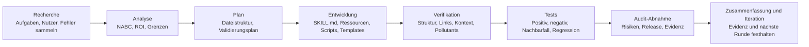

**Sprache:** [简体中文](README.md) | [English](README.en.md) | [日本語](README.ja.md) | [한국어](README.ko.md) | [Português](README.pt.md) | [Русский](README.ru.md) | [Français](README.fr.md) | [Italiano](README.it.md) | **Deutsch** | [Bahasa Indonesia](README.id.md) | [हिन्दी](README.hi.md)


# BLCaptain Meta Skill: der Skill zum Erstellen wiederverwendbarer Skills

Version: v1.0

Wenn du KI regelmäßig nutzt, kennst du wahrscheinlich dieses sehr praktische Problem:

Du erklärst dieselbe Aufgabe immer wieder, wiederholst dieselben Standards und musst denselben Workflow in jeder neuen Unterhaltung neu aufbauen.

BLCaptain Meta Skill wurde genau dafür gebaut.

Er unterstützt Claude Skills, Codex Skills und allgemeine Agent Skills. Er hilft, wiederholbare Erfahrung, SOPs, Tool-Routinen, Designstandards und kreative Prozesse in ein installierbares, aufrufbares, prüfbares und iterierbares Skill-Paket zu verwandeln.

Er ist nicht “noch ein längerer Prompt”. Er verwandelt “so mache ich diese Arbeit” in “eine Fähigkeit, die ein Agent zuverlässig wiederverwenden kann”.

> Du bringst einen wiederholbaren Workflow mit, der es wert ist, festgehalten zu werden; der Skill hilft zu entscheiden, ob daraus ein Skill werden sollte, und führt dich zu einem lieferbaren Capability-Paket.

## Herkunft

Dieser Skill ist das Ergebnis von 7 Kooperations- und Iterationsrunden zwischen Codex und Claude Code.

Die Entwicklung folgte einem 8-Schritte-Prozess:

```text
Recherche -> Analyse -> Plan -> Entwicklung -> Verifikation -> Tests -> Audit-Abnahme -> Zusammenfassung und Iteration
```

| Rolle | Hauptarbeit |
| --- | --- |
| Claude Code | Code gelesen, Anforderungen zerlegt, Architektur geplant, Review und Audit geliefert |
| Codex | Code geändert, Befehle ausgeführt, Tests repariert, Evidenz ergänzt, Release Checks durchgeführt |
| Menschlicher Reviewer | Richtung gesetzt, Grenzen definiert, weitere Korrekturen und Veröffentlichung entschieden |

Jede Runde durchlief Review, Korrektur, erneute Verifikation und Audit. Die öffentliche Version wurde durch reale Szenarien, Fehlerfälle, Validierungsbefehle und Review-Feedback geschärft.

## Warum es nötig ist

KI-Workflows entwickeln sich meist über drei Ebenen:

| Ebene | Typischer Zustand | Problem |
| --- | --- | --- |
| KI nutzen | Du schreibst Prompts und erledigst Einmalaufgaben | Kontext muss wiederholt werden; Ergebnisse schwanken |
| Methoden festhalten | Du hast SOPs, Templates, Prompts und Beispiele | Menschen verstehen sie; Agents führen sie nicht immer stabil aus |
| Fähigkeit produktisieren | Du hast Skill, Ressourcen, Scripts, Evals und Release Checks | Der Workflow wird wiederverwendbar, prüfbar, wartbar und lieferbar |

BLCaptain Meta Skill konzentriert sich auf die dritte Ebene: persönliches Know-how, Team-Methoden, Geschäftsprozesse und kreative Systeme in wiederverwendbare Agent-Fähigkeiten zu verwandeln.

## Gelöste Probleme

| Häufiges Problem | Ergebnis | Wie dieser Skill hilft |
| --- | --- | --- |
| Skill als langen Prompt behandeln | Viel Text, unklare Auslösung | Zuerst Trigger-Grenzen, positive/negative Fälle und Routing beschreiben |
| Alles in `SKILL.md` packen | Kontext wird schwer, Agent wird schlechter | Nutzt “dünnen Einstieg + tiefe Ressourcen” |
| Keine Validierung | Sieht fertig aus, scheitert im echten Einsatz | Ergänzt route eval, scenario eval, failure library und Regressionen |
| Unklar, ob Skill nötig ist | Einmalaufgaben werden wartungspflichtig | Nutzt Non-Skill gate vor der Umsetzung |
| Keine Fehlererfahrung | Happy path funktioniert, Randfälle brechen | Macht gotchas, Gegenbeispiele, Risiken und Fixes zu Assets |
| Unsicherheit vor Release | Dateien existieren, Vertrauen fehlt | Nutzt validator, context budget, quick validate und Release-Checkliste |

Kurz: Er hilft von “dieser Prompt wirkt nützlich” zu “dieses Paket kann installiert, verstanden, aufgerufen, geprüft und gewartet werden”.

## Für wen

- KI-Nutzer: tägliche Aufgaben, Vorlieben, Schreibstil und Workflows bewahren.
- Produktmanager: Requirements, PRD, Interviews, Wettbewerbsanalyse und Reviews stabilisieren.
- Operations: SOPs, Content-Verteilung, Kampagnen-Retros, Community und Nutzerkontakte paketieren.
- Entwickler / Engineers: Coding-Disziplin, Tests, Releases, Reviews und Toolchains ausführbar machen.
- Tester: positive, negative, Grenz- und Regressionstests entwerfen.
- Designer: Geschmack, Markenregeln, Layoutsysteme und Design-Tabus in ausführbare Standards übersetzen.
- Creators: Produktionsflows für Artikel, Visuals, Videos, Decks, Kurse und Themen bauen.
- Fachexperten: professionelles Urteil, Beratung, Servicestandards und Geschäftserfahrung produktisieren.

## Umfang

Gute Skill-Kandidaten haben meist:

| Merkmal | Bedeutung |
| --- | --- |
| Häufige Wiederholung | Es ist keine Einmalaufgabe; sie kommt wieder |
| Klarer Liefergegenstand | Ergebnis kann Dokument, Code, Bild, Tabelle, Audit oder Plan sein |
| Qualitätskriterien | Gut, schlecht und nicht lieferbar lassen sich erklären |
| Grenzen | Klar, wann der Skill auslösen soll und wann nicht |
| Fehlerbeispiele | Bekannt, wo KI scheitert, und daraus lassen sich Regeln bauen |
| Wartungswert | Zeitersparnis, Risikoreduktion oder Qualitätsgewinn übersteigen Kosten |

Weniger geeignet:

- Einzelne Faktenfrage.
- Einmalige Zusammenfassung, Übersetzung oder Umschreibung.
- Frühe Exploration ohne stabilen Prozess.
- Workflows, die niemand validieren will.

## Einsatzmöglichkeiten

| Einsatz | Passende Situation |
| --- | --- |
| Skill von Null bauen | Wiederholbarer Workflow vorhanden, aber unklar, wie `SKILL.md`, Ressourcen, Scripts und Evals getrennt werden |
| Alten Prompt upgraden | Nützlicher Prompt ist zu lang, fragil oder nicht testbar |
| Bestehenden Skill prüfen | Trigger, Tests, Risiken und Release-Bereitschaft prüfen |
| Team-SOP bauen | Teamwissen soll Agent-ausführbar werden |
| Creator-Pipeline bauen | Workflows für Artikel, Visuals, Videos, Decks oder Kurse wiederverwenden |
| Release vorbereiten | Struktur, Datenschutz, Pollutants, Tokens und Evidenz vor GitHub prüfen |

## Was entsteht

| Output | Zweck |
| --- | --- |
| `SKILL.md` | Dünner Einstieg: wann laden, was zuerst tun, wo Ressourcen lesen |
| `references/` | Tiefe Methoden, Grenzen, Schritte, Rollen-Zusammenarbeit, Plattformunterschiede |
| `assets/templates/` | Templates für Briefs, Specs, eval cases, gotchas und Iterationsprotokolle |
| `scripts/` | Deterministische Validierungsskripte |
| `evals/` | Routing, Szenarien, Failure Library, Forward Tests und Regressionsevidenz |
| `examples/` | Ausgearbeitete Beispiele zur Anwendung |
| `manifest.json` | Version, Status, Validierungsbefehle, Evidenzdateien und Release Governance |

## Workflow



| Schritt | Beantwortete Frage |
| --- | --- |
| Recherche | Wer ist der Nutzer? Was ist die echte Aufgabe? Welche Erfolgs- und Fehlerbeispiele gibt es? |
| Analyse | Lohnt sich ein Skill? Welche Grenzen, ROI und Alternativen gibt es? |
| Plan | Welche Struktur, Ressourcenebenen, Validierung und Release-Standards? |
| Entwicklung | `SKILL.md`, references, templates, scripts und evals schreiben |
| Verifikation | Struktur, Links, Kontextbudget, private Reste und Release-Pollutants prüfen |
| Tests | Mit positiven, negativen, nahen und Fehlerfällen beweisen |
| Audit-Abnahme | Entscheiden, ob veröffentlicht werden kann und welche Evidenz fehlt |
| Zusammenfassung und Iteration | Schlussfolgerungen, Restrisiken und nächste Verbesserungen festhalten |

Kurzversion: Wert prüfen, Grenzen gestalten, kleinsten nützlichen Skill bauen, mit Evidenz beweisen.

## Kernmechanismen

### 1. Non-Skill Gate

Nicht alles sollte ein Skill werden. Zuerst wird geprüft, ob besser passt:

- Einmalige Antwort
- Normale Dokumentation
- Projektregeln
- Script / CLI
- Template
- Memory
- Echter Skill

### 2. NABC + ROI

| Dimension | Frage |
| --- | --- |
| Need | Welcher echte Schmerz? Wiederholt er sich? |
| Approach | Welche Workflows, Ressourcen, Scripts und Constraints lösen ihn? |
| Benefit | Was spart, verbessert oder ent-risked es gegenüber normalem Chat? |
| Competition | Warum nicht Dokument, Script, Template, Projektregel oder Einmalprompt? |

### 3. Dünner Einstieg, tiefe Ressourcen

`SKILL.md` bleibt kurz und signalstark. Komplexe Methoden, Beispiele, Fehlerbibliotheken, Templates und Scripts liegen in Ressourcen und werden nur bei Bedarf geladen.

### 4. Failure Library zuerst

Stabile Skills dokumentieren Nicht-Trigger, scheinbar richtige aber falsche Outputs, veränderliche Plattformregeln, notwendige Nutzerfragen und Befehle mit Permission- oder Sicherheitsrisiko.

### 5. Evidenzgetriebener Release

Vertrauen entsteht durch route evals, scenario evals, failure library, regression history, validators, context budgets und Release-Hygienechecks.

## Nutzung

```text
Use $blcaptain-meta-skill to turn this repeatable workflow into a publishable Agent Skill.
```

```text
Use $blcaptain-meta-skill Ich habe einen Social-Media-Card-Workflow und möchte daraus einen Skill machen.
```

```text
Use $blcaptain-meta-skill Prüfe diesen Skill und ergänze evals, gotchas, release checks und governance.
```

## Installation

### Codex / lokaler Agent

Kopiere `blcaptain-meta-skill/` in dein skills-Verzeichnis.

```bash
mkdir -p ~/.codex/skills
cp -R blcaptain-meta-skill ~/.codex/skills/
```

In einer neuen Session:

```text
Use $blcaptain-meta-skill Ich möchte einen wiederholbaren Workflow in einen Skill verwandeln.
```

### Claude Skills / andere Agents

1. Der Agent muss `blcaptain-meta-skill/SKILL.md` lesen können.
2. Zugriff auf `references/`, `assets/templates/`, `examples/`, `evals/` und `scripts/` prüfen.
3. Installationspfad und Metadata-Regeln der Zielplattform neu prüfen.
4. Vor Veröffentlichung Validierungsbefehle ausführen.

## Verifikation

```bash
python3 blcaptain-meta-skill/scripts/validate_meta_skill.py blcaptain-meta-skill
python3 blcaptain-meta-skill/scripts/eval_routes.py blcaptain-meta-skill/evals/route_cases.json
python3 blcaptain-meta-skill/scripts/context_budget.py blcaptain-meta-skill/SKILL.md
python3 "${CODEX_HOME:-$HOME/.codex}/skills/.system/skill-creator/scripts/quick_validate.py" blcaptain-meta-skill
```

Für strengere Token-, Visual- und Release-Hygienechecks `RELEASE_CHECKLIST.md` ausführen.

## Repository-Struktur

```text
.
├── README.md
├── README.de.md
├── RELEASE_CHECKLIST.md
├── docs/
├── blcaptain-meta-skill/
└── third-round-forward-test/
```

## Typische Szenarien

| Szenario | Mögliche Anfrage |
| --- | --- |
| Neuer Skill von Null | “Ich habe einen wiederholbaren Workflow. Hilf zu entscheiden, ob daraus ein Skill werden sollte, und entwirf die Struktur.” |
| Alter Prompt | “Verwandle diesen Prompt in einen installierbaren Skill.” |
| Bestehenden Skill prüfen | “Prüfe routing, evals, gotchas, release pollutants und governance gaps.” |
| Team-SOP | “Verwandle diese Ops-SOP in einen Skill, den ein Agent ausführen, prüfen und iterieren kann.” |
| Creator-Workflow | “Verwandle meinen Content-Prozess in einen Skill mit Templates, Gegenbeispielen und Plattformchecks.” |
| Release vorbereiten | “Führe die Release-Checkliste aus und sag mir, ob es bereit für GitHub ist.” |

## FAQ

### Ist das nur ein Prompt?

Nein. Prompts sind enthalten, aber der Kern ist ein Capability-Paket: Einstieg, Ressourcen, Templates, Scripts, Validierung, Evidenz und Governance.

### Können Nicht-Techniker es nutzen?

Ja. Beschreibe Workflow und Ziel; der Agent kann diesen Skill nutzen, um alles zu zerlegen. Für GitHub-Release sollte jemand die Engineering-Checks ausführen.

### Welche Aufgaben passen am besten?

Wiederholte, wertvolle, stabile, fehleranfällige, prüfbare und wiederverwendbare Aufgaben.

### Welche Aufgaben passen nicht?

Einmalige Erklärungen, einfache Zusammenfassungen, temporäres Brainstorming, einmalige Übersetzungen und instabile Explorationen.

### Kann er den Skill für mich veröffentlichen?

Er kann Struktur, Scripts, Validierung und Release Checks vorbereiten. Datenschutz, echte Assets, Repository-Text, öffentliches Positioning und Wartungsverantwortung bleiben menschliche Entscheidungen.

## Autor

爆裂队长NEXT

15yr PM. Fired myself. Hired 10 AIs. Turns out managing AIs is harder than managing humans.

AI Agents BLTeam Feldnotizen: echte Produktionspraxis und Signale aus erster Hand.

X/Twitter: [@thinkszyg](https://x.com/thinkszyg)

Email: blteam2026@outlook.com
