**Language:** [简体中文](README.md) | **English** | [日本語](README.ja.md) | [한국어](README.ko.md) | [Português](README.pt.md) | [Русский](README.ru.md) | [Français](README.fr.md) | [Italiano](README.it.md) | [Deutsch](README.de.md) | [Bahasa Indonesia](README.id.md) | [हिन्दी](README.hi.md)


# BLCaptain Meta Skill: The Skill for Building Reusable Skills

Version: v1.0

If you use AI every day, you have probably hit this problem:

You explain the same task again and again. You repeat the same standards. The model helps once, then forgets the workflow next time.

BLCaptain Meta Skill is built for that moment.

It supports Claude Skills, Codex Skills, and general Agent Skills. It helps you turn reusable experience, SOPs, tool routines, design standards, or creative workflows into an installable, callable, testable, and iteratable Skill package.

It is not “one more long prompt.” It helps you turn “how I do this work” into “a capability product an Agent can reuse reliably.”

> You bring a repeatable workflow worth preserving; it helps you decide whether it should become a Skill, then guides you toward a deliverable capability package.

## Where It Comes From

This Skill is the result of 7 rounds of collaboration and iteration between Codex and Claude Code.

The development process followed an 8-step workflow:

```text
Research -> Analysis -> Plan -> Development -> Verification -> Testing -> Audit Acceptance -> Iteration Summary
```

| Role | Main work |
| --- | --- |
| Claude Code | Read code, decomposed requirements, planned architecture, provided review and audit feedback |
| Codex | Edited code, ran commands, fixed tests, added evidence, performed release checks |
| Human reviewer | Set direction, constrained scope, decided whether to continue remediation and release |

Each round was reviewed, fixed, verified, and audited again. The current public version exists because the Skill was shaped by real scenarios, failure cases, validation commands, and review feedback.

## Why You Need It

AI workflows usually move through three levels:

| Stage | Common state | Problem |
| --- | --- | --- |
| Using AI | You can write prompts and finish one-off tasks | You still repeat context every time; results vary |
| Capturing methods | You have SOPs, templates, prompts, and cases | Humans understand them; Agents may not execute them reliably |
| Productizing capability | You have a Skill, resources, scripts, evals, and release checks | The workflow becomes reusable, testable, maintainable, and deliverable |

BLCaptain Meta Skill focuses on the third level: turning personal know-how, team methods, business processes, and creative systems into reusable Agent capabilities.

## Problems It Solves

| Common problem | Result | How this Skill helps |
| --- | --- | --- |
| Treating a Skill as a long prompt | Lots of text, unclear trigger behavior | Designs trigger boundaries, positive cases, negative cases, and routing descriptions first |
| Putting everything into `SKILL.md` | Heavy context makes the Agent worse | Uses a “thin entry + deep resources” structure |
| No validation | Looks complete, fails in real use | Adds route evals, scenario evals, failure libraries, and regression records |
| Not knowing whether a Skill is needed | One-off tasks become maintenance burden | Uses a Non-Skill gate before implementation |
| No failure memory | Happy paths work, edge cases break | Treats gotchas, counterexamples, risks, and fixes as first-class assets |
| Unsure before release | Files exist, but release confidence is low | Uses validator, context budget, quick validate, and a release checklist |

In short, it helps you move from “this prompt feels useful” to “this capability package can be installed, understood, called, verified, and maintained by others.”

## Who It Is For

- AI users: preserve daily workflows, preferences, writing patterns, and repeatable tasks.
- Product managers: turn requirement analysis, PRDs, interviews, competitor research, and review routines into stable methods.
- Operations teams: package SOPs, content distribution, campaign reviews, community work, and user outreach.
- Developers and engineers: encode coding discipline, testing, release checks, reviews, and toolchains.
- Testers: design positive, negative, boundary, and regression cases for Skills.
- Designers: convert taste rules, brand constraints, layout systems, and design taboos into executable standards.
- Creators: build content production flywheels for articles, visuals, videos, decks, courses, and topics.
- Domain experts: productize professional judgment, consulting flows, service standards, and business experience.

## Supported Platforms

It is not only for Codex, and it is not only for Claude Code.

BLCaptain Meta Skill is a standard Skill folder: `SKILL.md` + `references/` + `assets/` + `examples/` + `evals/` + `scripts/`. Any Agent that can read a local Skill folder or supports Agent Skills-style capabilities can use it with the right platform-specific setup.

| Platform / tool | Support mode | Notes |
| --- | --- | --- |
| Codex / OpenAI Agent Skills | Direct install | Copy `blcaptain-meta-skill/` into your local skills directory and call `$blcaptain-meta-skill` |
| Claude Skills | Compatible | Import or place `blcaptain-meta-skill/` wherever the target platform expects Skill packages |
| Claude Code | Compatible | Let Claude Code read this repository or the Skill folder, then use `SKILL.md` and the resource directories |
| Other Skill-capable Agents | General methodology package | If the Agent can read `SKILL.md` and resource folders, it can follow the workflow; metadata may need platform-specific adjustment |
| Plain chatbots | Not recommended as an install target | If the tool cannot read folders, scripts, or resources, use this only as methodology reference |

Official docs describe Agent Skills as packages of instructions, metadata, scripts, templates, and resources that extend an Agent’s capabilities. This project follows that model; it is not a prompt tied to one client.

## Scope

Tasks worth turning into a Skill usually have these traits:

| Trait | Meaning |
| --- | --- |
| Repeated often | It is not one-off; you will do it again |
| Clear deliverable | The output can be a document, code, image, spreadsheet, audit report, or plan |
| Quality criteria | You can explain what is good, bad, and not shippable |
| Boundaries | You know when it should and should not trigger |
| Failure examples | You know where AI tends to fail and can turn that into rules |
| Worth maintaining | The saved time, reduced risk, or improved quality exceeds maintenance cost |

Poor fits:

- One factual question.
- One-time summary, translation, or rewrite.
- Early idea exploration without a stable process.
- Workflows that nobody wants to validate.

## What You Can Use It For

| Use case | Good fit |
| --- | --- |
| Create a Skill from scratch | You have a repeatable workflow but do not know how to split `SKILL.md`, resources, scripts, and evals |
| Upgrade an old prompt | You have a useful prompt that is too long, brittle, or untestable |
| Review an existing Skill | You need to check trigger boundaries, tests, risks, and release readiness |
| Build a team SOP | You want team knowledge to become an Agent-executable workflow |
| Build a creator pipeline | You want reusable workflows for articles, visuals, videos, decks, or courses |
| Prepare for release | You need structure, privacy, pollutants, token budget, and evidence checks before GitHub release |

## What It Produces

| Output | Purpose |
| --- | --- |
| `SKILL.md` | Thin entry: when to load, what to do first, and where to read resources |
| `references/` | Deep methods, boundaries, steps, role collaboration, and platform differences |
| `assets/templates/` | Templates for briefs, specs, eval cases, gotchas, and iteration records |
| `scripts/` | Deterministic validation scripts |
| `evals/` | Routing, scenarios, failure library, forward tests, and regression evidence |
| `examples/` | Worked examples showing how to apply the Skill |
| `manifest.json` | Version, status, validation commands, evidence files, and release governance |

## Workflow

```mermaid
flowchart LR
    A["Research<br/>Collect tasks, users, failures"] --> B["Analysis<br/>NABC, ROI, boundaries"]
    B --> C["Plan<br/>File structure, validation plan"]
    C --> D["Development<br/>SKILL.md, resources, scripts, templates"]
    D --> E["Verification<br/>Structure, links, context, pollutants"]
    E --> F["Testing<br/>Positive, negative, neighbor, regression"]
    F --> G["Audit Acceptance<br/>Risks, release, evidence"]
    G --> H["Iteration Summary<br/>Record evidence and next round"]
```



| Step | Question answered |
| --- | --- |
| Research | Who is the user? What is the real task? What are success and failure samples? |
| Analysis | Is it worth a Skill? What are the boundaries, ROI, and alternatives? |
| Plan | What file structure, resource layers, validation plan, and release standard should be used? |
| Development | Write `SKILL.md`, references, templates, scripts, and evals |
| Verification | Check structure, links, context budget, private residue, and release pollutants |
| Testing | Prove it works with positive, negative, near-neighbor, and failure cases |
| Audit Acceptance | Decide whether it can ship and what evidence is missing |
| Iteration Summary | Record conclusions, residual risks, and next improvements |

Short version: decide whether it is worth building, design boundaries, build the smallest useful Skill, then prove it works with evidence.

## Core Mechanisms

### 1. Non-Skill Gate

Not everything should become a Skill. The Skill first checks whether the need is better handled as:

- A one-off answer
- Ordinary documentation
- Project rules
- A script / CLI
- A template
- Memory
- A real Skill

### 2. NABC + ROI

| Dimension | Question |
| --- | --- |
| Need | What real pain does the user have? Does it repeat? |
| Approach | What workflow, resources, scripts, and constraints solve it? |
| Benefit | What does it save, improve, or de-risk compared with ordinary chat? |
| Competition | Why not a document, script, template, project rule, or one-off prompt? |

### 3. Thin Entry, Deep Resources

`SKILL.md` should stay short and high-signal. Complex methods, examples, failure libraries, templates, and scripts should live in resource folders and be loaded only when needed.

### 4. Failure Library First

Stable Skills record what should not trigger, what looks right but is wrong, which platform rules may change, when the user must be asked, and which commands carry permission or safety risk.

### 5. Evidence-Driven Release

Release confidence comes from route evals, scenario evals, failure libraries, regression history, validators, context budgets, and release hygiene checks.

## Usage

```text
Use $blcaptain-meta-skill to turn this repeatable workflow into a publishable Agent Skill.
```

```text
Use $blcaptain-meta-skill I have a social media card production workflow and want to make it a Skill.
```

```text
Use $blcaptain-meta-skill Review this existing Skill and fill gaps in evals, gotchas, release checks, and governance.
```

## Installation

### 1. Get the Project

Clone with Git:

```bash
git clone https://github.com/dososo/blcaptain-meta-skill.git
cd blcaptain-meta-skill
```

Or use `Code -> Download ZIP` on GitHub and unzip it locally.

### 2. Codex / Local Agent

Copy the inner Skill package folder `blcaptain-meta-skill/` into your skills directory.

```bash
mkdir -p ~/.codex/skills
cp -R blcaptain-meta-skill ~/.codex/skills/
```

Then start a new session:

```text
Use $blcaptain-meta-skill I want to turn a repeatable workflow into a Skill.
```

### 3. Claude Skills / Claude Code / Other Agents

Different clients have different install surfaces, but the core steps are the same:

1. Import, upload, or point the Agent to the `blcaptain-meta-skill/` folder in this repository.
2. Make sure it can read `blcaptain-meta-skill/SKILL.md`.
3. Make sure it can access `references/`, `assets/templates/`, `examples/`, `evals/`, and `scripts/`.
4. Recheck the target platform’s metadata, install path, and permissions.
5. Start a new session and call:

```text
Use $blcaptain-meta-skill I want to turn a repeatable workflow into a Skill.
```

If the platform does not yet provide a Skill import feature, provide this repository as project context and ask the Agent to read `blcaptain-meta-skill/SKILL.md` before acting.

### 4. Verify the Install

Run the basic checks:

```bash
python3 blcaptain-meta-skill/scripts/validate_meta_skill.py blcaptain-meta-skill
python3 blcaptain-meta-skill/scripts/eval_routes.py blcaptain-meta-skill/evals/route_cases.json
python3 blcaptain-meta-skill/scripts/context_budget.py blcaptain-meta-skill/SKILL.md
python3 "${CODEX_HOME:-$HOME/.codex}/skills/.system/skill-creator/scripts/quick_validate.py" blcaptain-meta-skill
```

If these commands pass, the package structure, route fixtures, and context budget are usable.

## Verification

```bash
python3 blcaptain-meta-skill/scripts/validate_meta_skill.py blcaptain-meta-skill
python3 blcaptain-meta-skill/scripts/eval_routes.py blcaptain-meta-skill/evals/route_cases.json
python3 blcaptain-meta-skill/scripts/context_budget.py blcaptain-meta-skill/SKILL.md
python3 "${CODEX_HOME:-$HOME/.codex}/skills/.system/skill-creator/scripts/quick_validate.py" blcaptain-meta-skill
```

For stricter token, visual, and release hygiene checks, run `RELEASE_CHECKLIST.md`.

## Repository Structure

```text
.
├── README.md
├── README.en.md
├── RELEASE_CHECKLIST.md
├── docs/
│   └── blcaptain-meta-skill-design.md
├── blcaptain-meta-skill/
│   ├── SKILL.md
│   ├── agents/
│   ├── references/
│   ├── assets/
│   ├── examples/
│   ├── evals/
│   ├── scripts/
│   └── manifest.json
└── third-round-forward-test/
```

## Typical Scenarios

| Scenario | What to say |
| --- | --- |
| New Skill from zero | “I have a repeatable workflow. Help me decide whether it should become a Skill and design the structure.” |
| Old prompt upgrade | “Upgrade this prompt into an installable Skill.” |
| Existing Skill review | “Check routing, evals, gotchas, release pollutants, and governance gaps.” |
| Team SOP | “Turn this operations SOP into an Agent-executable, testable, iteratable Skill.” |
| Creator workflow | “Turn my content production process into a Skill with templates, counterexamples, and platform checks.” |
| Release preparation | “Run the release checklist and tell me whether it is ready for GitHub.” |

## FAQ

### Is this just a prompt?

No. It includes prompts, but the core is a capability package: entry, resources, templates, scripts, validation, evidence, and release governance.

### Can non-technical users use it?

Yes. Describe your workflow and goal; the Agent can follow this Skill to help you break it down. For GitHub release, ask someone comfortable with engineering checks to run the scripts.

### What tasks are most suitable?

Repeated, valuable, stable, error-prone, testable, and reusable tasks.

### What tasks are not suitable?

One-off explanations, simple summaries, temporary brainstorming, single translations, and unstable explorations.

### Can it publish the Skill for me?

It can prepare structure, scripts, validation, and release checks. Humans still decide privacy, real assets, repository wording, release positioning, and maintenance responsibility.

## Author

Burst Captain NEXT

15yr PM. Fired myself. Hired 10 AIs. Turns out managing AIs is harder than managing humans.

AI Agents BLTeam field notes. Real production practice and durable first-hand signals.

X/Twitter: [@thinkszyg](https://x.com/thinkszyg)

Email: blteam2026@outlook.com

## License

Free for personal use and open-source projects. Closed-source commercial use requires commercial authorization.

See [LICENSE](LICENSE) for details.
