**Langue :** [简体中文](README.md) | [English](README.en.md) | [日本語](README.ja.md) | [한국어](README.ko.md) | [Português](README.pt.md) | [Русский](README.ru.md) | **Français** | [Italiano](README.it.md) | [Deutsch](README.de.md) | [Bahasa Indonesia](README.id.md) | [हिन्दी](README.hi.md)


# BLCaptain Meta Skill : le Skill pour créer des Skills réutilisables

Version : v1.0

Si vous utilisez l’IA tous les jours, vous avez sûrement déjà rencontré ce problème très concret :

vous expliquez la même tâche encore et encore, vous répétez les mêmes critères, et le même workflow doit être réexpliqué à chaque nouvelle conversation.

BLCaptain Meta Skill a été créé pour résoudre cela.

Il prend en charge Claude Skills, Codex Skills et les Agent Skills génériques. Il aide à transformer des expériences répétables, des SOP, des routines d’outils, des standards de design ou des processus créatifs en un package Skill installable, appelable, vérifiable et améliorable.

Ce n’est pas “un prompt plus long”. C’est une méthode pour transformer “voici comment je travaille” en “une capacité qu’un Agent peut réutiliser de façon fiable”.

> Vous apportez un workflow répétable qui mérite d’être conservé ; il vous aide à décider s’il doit devenir un Skill, puis vous guide vers un package de capacité réellement livrable.

## Origine

Ce Skill est le résultat de 7 cycles de collaboration et d’itération entre Codex et Claude Code.

Le développement a suivi un workflow en 8 étapes :

```text
Recherche -> Analyse -> Plan -> Développement -> Vérification -> Tests -> Acceptation d’audit -> Synthèse et itération
```

| Rôle | Travail principal |
| --- | --- |
| Claude Code | Lecture du code, découpage des besoins, plan d’architecture, review et audit |
| Codex | Modifications de code, exécution de commandes, correction des tests, ajout de preuves, vérification avant release |
| Relecteur humain | Direction, limites, décision de poursuivre les corrections et de publier |

Chaque cycle a été relu, corrigé, revérifié et réaudité. La version publique actuelle a été façonnée par des scénarios réels, des cas d’échec, des commandes de validation et des retours d’audit.

## Pourquoi l’utiliser

Les workflows IA évoluent souvent en trois niveaux :

| Niveau | État courant | Problème |
| --- | --- | --- |
| Utiliser l’IA | Vous écrivez des prompts et terminez des tâches ponctuelles | Le contexte doit être répété ; les résultats varient |
| Formaliser une méthode | Vous avez des SOP, modèles, prompts et exemples | Les humains comprennent, mais l’Agent n’exécute pas toujours de façon stable |
| Productiser une capacité | Vous avez un Skill, des ressources, scripts, evals et checks de release | Le workflow devient réutilisable, vérifiable, maintenable et livrable |

BLCaptain Meta Skill vise le troisième niveau : transformer savoir-faire personnel, méthodes d’équipe, processus métier et systèmes créatifs en capacités Agent réutilisables.

## Problèmes résolus

| Problème fréquent | Résultat | Comment ce Skill aide |
| --- | --- | --- |
| Traiter un Skill comme un long prompt | Beaucoup de texte, déclenchement flou | Définit d’abord les limites de déclenchement, exemples positifs/négatifs et routing |
| Tout mettre dans `SKILL.md` | Contexte lourd, Agent moins efficace | Utilise une structure “entrée fine + ressources profondes” |
| Aucune validation | Semble complet, échoue en usage réel | Ajoute route eval, scenario eval, failure library et historique de régression |
| Ne pas savoir si un Skill est nécessaire | Des tâches uniques deviennent du coût de maintenance | Applique un Non-Skill gate avant l’implémentation |
| Pas de mémoire des échecs | Le cas nominal marche, les bords cassent | Transforme gotchas, contre-exemples, risques et corrections en actifs |
| Incertitude avant publication | Les fichiers existent, mais la confiance manque | Utilise validator, context budget, quick validate et checklist de release |

En bref, il vous aide à passer de “ce prompt semble utile” à “ce package peut être installé, compris, appelé, vérifié et maintenu par d’autres”.

## Pour qui

- Utilisateurs IA : conserver tâches fréquentes, préférences, style d’écriture et workflows.
- Product managers : stabiliser analyse de besoins, PRD, interviews, benchmark et reviews.
- Ops : packager SOP, distribution de contenu, bilans de campagne, communauté et contact utilisateur.
- Développeurs / ingénieurs : formaliser discipline de code, tests, release, review et toolchain.
- Testeurs : concevoir cas positifs, négatifs, limites et régressions.
- Designers : convertir règles de goût, contraintes de marque, systèmes de mise en page et interdits en standards exécutables.
- Créateurs : construire des workflows réutilisables pour articles, visuels, vidéos, decks, cours et idées.
- Experts métier : productiser jugement professionnel, processus de conseil, standards de service et expérience business.

## Périmètre

Les tâches adaptées à un Skill ont souvent ces traits :

| Trait | Signification |
| --- | --- |
| Répétition fréquente | Ce n’est pas une tâche unique ; elle reviendra |
| Livrable clair | Le résultat peut être document, code, image, tableau, audit ou plan |
| Critères qualité | On peut expliquer ce qui est bon, mauvais ou non livrable |
| Limites | On sait quand déclencher et quand ne pas déclencher |
| Exemples d’échec | On sait où l’IA échoue et on peut en faire des règles |
| Valeur de maintenance | Temps gagné, risque réduit ou qualité accrue dépassent le coût |

Peu adapté :

- Question factuelle unique.
- Résumé, traduction ou réécriture ponctuelle.
- Exploration initiale sans processus stable.
- Workflow que personne ne veut vérifier.

## Cas d’usage

| Usage | Situation adaptée |
| --- | --- |
| Créer un Skill de zéro | Vous avez un workflow répétable mais ne savez pas séparer `SKILL.md`, ressources, scripts et evals |
| Améliorer un ancien prompt | Vous avez un prompt utile mais trop long, fragile ou non testable |
| Auditer un Skill existant | Vous devez vérifier triggers, tests, risques et préparation de release |
| Construire un SOP d’équipe | Vous voulez transformer le savoir d’équipe en workflow exécutable par Agent |
| Construire une chaîne créative | Vous voulez réutiliser des workflows d’articles, visuels, vidéos, decks ou cours |
| Préparer une publication | Vous devez vérifier structure, confidentialité, polluants, tokens et preuves avant GitHub |

## Ce qu’il produit

| Sortie | Rôle |
| --- | --- |
| `SKILL.md` | Entrée fine : quand charger, quoi faire d’abord, où lire les ressources |
| `references/` | Méthodes profondes, limites, étapes, collaboration des rôles, différences de plateformes |
| `assets/templates/` | Modèles de brief, spécification, eval case, gotcha et journal d’itération |
| `scripts/` | Scripts de validation déterministes |
| `evals/` | Routing, scénarios, failure library, forward tests et preuves de régression |
| `examples/` | Exemples travaillés montrant l’application |
| `manifest.json` | Version, statut, commandes de validation, preuves et gouvernance de release |

## Workflow

```mermaid
flowchart LR
    A["Recherche<br/>Collecter tâches, utilisateurs, échecs"] --> B["Analyse<br/>NABC, ROI, limites"]
    B --> C["Plan<br/>Structure fichiers, plan validation"]
    C --> D["Développement<br/>SKILL.md, ressources, scripts, modèles"]
    D --> E["Vérification<br/>Structure, liens, contexte, polluants"]
    E --> F["Tests<br/>Positif, négatif, voisin, régression"]
    F --> G["Acceptation d’audit<br/>Risques, release, preuves"]
    G --> H["Synthèse et itération<br/>Enregistrer preuves et suite"]
```



| Étape | Question traitée |
| --- | --- |
| Recherche | Qui est l’utilisateur ? Quelle est la vraie tâche ? Quels exemples de réussite et d’échec ? |
| Analyse | Cela vaut-il un Skill ? Quelles limites, ROI et alternatives ? |
| Plan | Quelle structure, quelles couches de ressources, quelle validation et quel standard de release ? |
| Développement | Écrire `SKILL.md`, references, templates, scripts et evals |
| Vérification | Vérifier structure, liens, budget de contexte, résidus privés et polluants |
| Tests | Prouver avec cas positifs, négatifs, proches et d’échec |
| Acceptation d’audit | Décider si l’on peut publier et quelles preuves manquent |
| Synthèse et itération | Noter conclusions, risques résiduels et améliorations suivantes |

Version courte : décider si cela vaut la peine, définir les limites, construire le plus petit Skill utile, puis prouver qu’il fonctionne.

## Mécanismes clés

### 1. Non-Skill Gate

Tout ne doit pas devenir un Skill. Il vérifie d’abord si le besoin relève plutôt de :

- Réponse ponctuelle
- Documentation ordinaire
- Règles de projet
- Script / CLI
- Modèle
- Mémoire
- Vrai Skill

### 2. NABC + ROI

| Dimension | Question |
| --- | --- |
| Need | Quelle douleur réelle ? Est-elle répétée ? |
| Approach | Quel workflow, quelles ressources, scripts et contraintes résolvent le problème ? |
| Benefit | Qu’est-ce qui est économisé, amélioré ou dérisqué face à un chat classique ? |
| Competition | Pourquoi pas document, script, modèle, règle projet ou prompt ponctuel ? |

### 3. Entrée fine, ressources profondes

`SKILL.md` doit rester court et très signalé. Méthodes complexes, exemples, bibliothèques d’échecs, templates et scripts vivent dans les ressources et sont chargés seulement si nécessaire.

### 4. Bibliothèque d’échecs d’abord

Un Skill stable note quand ne pas se déclencher, quelles sorties semblent correctes mais sont fausses, quelles règles de plateformes peuvent changer, quand demander à l’utilisateur et quelles commandes ont un risque de permission ou sécurité.

### 5. Release pilotée par les preuves

La confiance vient des route evals, scenario evals, failure library, regression history, validators, context budgets et checks d’hygiène de release.

## Utilisation

```text
Use $blcaptain-meta-skill to turn this repeatable workflow into a publishable Agent Skill.
```

```text
Use $blcaptain-meta-skill J’ai un workflow de cartes pour réseaux sociaux et je veux en faire un Skill.
```

```text
Use $blcaptain-meta-skill Audite ce Skill existant et complète evals, gotchas, release checks et gouvernance.
```

## Installation

### Codex / Agent local

Copiez `blcaptain-meta-skill/` dans votre dossier skills.

```bash
mkdir -p ~/.codex/skills
cp -R blcaptain-meta-skill ~/.codex/skills/
```

Dans une nouvelle session :

```text
Use $blcaptain-meta-skill Je veux transformer un workflow répétable en Skill.
```

### Claude Skills / autres Agents

1. L’Agent doit lire `blcaptain-meta-skill/SKILL.md`.
2. Vérifiez l’accès à `references/`, `assets/templates/`, `examples/`, `evals/` et `scripts/`.
3. Revalidez le chemin d’installation et les règles metadata de la plateforme cible.
4. Exécutez les commandes de validation avant publication.

## Vérification

```bash
python3 blcaptain-meta-skill/scripts/validate_meta_skill.py blcaptain-meta-skill
python3 blcaptain-meta-skill/scripts/eval_routes.py blcaptain-meta-skill/evals/route_cases.json
python3 blcaptain-meta-skill/scripts/context_budget.py blcaptain-meta-skill/SKILL.md
python3 "${CODEX_HOME:-$HOME/.codex}/skills/.system/skill-creator/scripts/quick_validate.py" blcaptain-meta-skill
```

Pour des checks plus stricts de tokens, visuels et hygiène de release, utilisez `RELEASE_CHECKLIST.md`.

## Structure du dépôt

```text
.
├── README.md
├── README.fr.md
├── RELEASE_CHECKLIST.md
├── docs/
├── blcaptain-meta-skill/
└── third-round-forward-test/
```

## Scénarios typiques

| Scénario | Formulation possible |
| --- | --- |
| Nouveau Skill | “J’ai un workflow répétable. Aide-moi à décider s’il doit devenir un Skill et à concevoir la structure.” |
| Ancien prompt | “Transforme ce prompt en Skill installable.” |
| Review de Skill | “Vérifie routing, evals, gotchas, polluants de release et lacunes de gouvernance.” |
| SOP d’équipe | “Transforme ce SOP ops en Skill exécutable, vérifiable et itérable.” |
| Workflow créatif | “Transforme mon processus de contenu en Skill avec modèles, contre-exemples et checks plateforme.” |
| Préparation release | “Lance la checklist de release et dis-moi si c’est prêt pour GitHub.” |

## FAQ

### Est-ce seulement un prompt ?

Non. Il contient des prompts, mais le cœur est un package de capacité : entrée, ressources, templates, scripts, validation, preuves et gouvernance.

### Les non-techniciens peuvent-ils l’utiliser ?

Oui. Décrivez votre workflow et votre objectif ; l’Agent peut suivre ce Skill pour le décomposer. Pour GitHub, demandez à quelqu’un à l’aise avec les checks d’ingénierie de lancer les scripts.

### Quelles tâches conviennent le mieux ?

Les tâches répétées, utiles, stables, sujettes aux erreurs, vérifiables et réutilisables.

### Quelles tâches ne conviennent pas ?

Explications ponctuelles, simples résumés, brainstorming temporaire, traduction unique et explorations instables.

### Peut-il publier le Skill pour moi ?

Il prépare structure, scripts, validation et checks de release. Les humains décident encore de la confidentialité, des assets réels, du texte du dépôt, du positionnement public et de la maintenance.

## Auteur

爆裂队长NEXT

15yr PM. Fired myself. Hired 10 AIs. Turns out managing AIs is harder than managing humans.

Notes de terrain AI Agents BLTeam : pratique réelle en production et signaux de première main.

X/Twitter: [@thinkszyg](https://x.com/thinkszyg)

Email: blteam2026@outlook.com

## License

Gratuit pour un usage personnel et les projets open-source. L’usage commercial en code fermé nécessite une autorisation commerciale.

Voir [LICENSE](LICENSE) pour les détails.
