**भाषा:** [简体中文](README.md) | [English](README.en.md) | [日本語](README.ja.md) | [한국어](README.ko.md) | [Português](README.pt.md) | [Русский](README.ru.md) | [Français](README.fr.md) | [Italiano](README.it.md) | [Deutsch](README.de.md) | [Bahasa Indonesia](README.id.md) | **हिन्दी**


# BLCaptain Meta Skill: पुन: उपयोग योग्य Skills बनाने वाला Skill

संस्करण: v1.0

अगर आप AI का रोज़ इस्तेमाल करते हैं, तो आपने शायद यह व्यावहारिक समस्या देखी होगी:

एक ही काम बार-बार समझाना पड़ता है। वही मानक दोहराने पड़ते हैं। वही workflow हर नई बातचीत में फिर से बताना पड़ता है।

BLCaptain Meta Skill इसी समस्या को हल करने के लिए बनाया गया है।

यह Claude Skills, Codex Skills और सामान्य Agent Skills को समर्थन देता है। यह दोहराए जाने वाले अनुभव, SOP, tool routines, design standards और creative processes को ऐसे Skill package में बदलने में मदद करता है जिसे install, call, verify और iterate किया जा सके।

यह “एक और लंबा prompt” नहीं है। यह “मैं यह काम कैसे करता हूं” को “Agent द्वारा स्थिर रूप से दोबारा इस्तेमाल की जा सकने वाली capability” में बदलने की पद्धति है।

> आप एक repeatable workflow लाते हैं जिसे सुरक्षित रखना उपयोगी है; यह तय करने में मदद करता है कि उसे Skill बनाना चाहिए या नहीं, और फिर उसे deliverable capability package तक ले जाता है।

## यह कहां से आया

यह Skill Codex और Claude Code के बीच 7 rounds की collaboration और iteration का परिणाम है।

विकास ने 8-step workflow का पालन किया:

```text
Research -> Analysis -> Plan -> Development -> Verification -> Testing -> Audit Acceptance -> Iteration Summary
```

| भूमिका | मुख्य काम |
| --- | --- |
| Claude Code | Code पढ़ना, requirements तोड़ना, architecture plan करना, review और audit feedback देना |
| Codex | Code edits करना, commands चलाना, tests ठीक करना, evidence जोड़ना, release checks करना |
| Human reviewer | दिशा तय करना, boundaries रखना, remediation और release का निर्णय लेना |

हर round में review, fix, re-verification और audit हुआ। वर्तमान public version real scenarios, failure cases, validation commands और review feedback से बना है।

## इसकी जरूरत क्यों है

AI workflows आमतौर पर तीन levels से गुजरते हैं:

| Level | सामान्य स्थिति | समस्या |
| --- | --- | --- |
| AI इस्तेमाल करना | आप prompts लिखते हैं और one-off tasks पूरे करते हैं | context बार-बार दोहराना पड़ता है; results बदलते रहते हैं |
| Methods capture करना | आपके पास SOPs, templates, prompts और examples हैं | Humans समझते हैं, लेकिन Agent हमेशा stable execution नहीं करता |
| Capability productize करना | आपके पास Skill, resources, scripts, evals और release checks हैं | workflow reusable, testable, maintainable और deliverable बनता है |

BLCaptain Meta Skill तीसरे level पर focus करता है: personal know-how, team methods, business processes और creative systems को reusable Agent capabilities में बदलना।

## यह कौन-सी समस्याएं हल करता है

| सामान्य समस्या | परिणाम | यह Skill कैसे मदद करता है |
| --- | --- | --- |
| Skill को लंबा prompt मान लेना | Text बहुत, trigger behavior unclear | पहले trigger boundaries, positive cases, negative cases और routing descriptions design करता है |
| सब कुछ `SKILL.md` में भर देना | context भारी, Agent कम प्रभावी | “thin entry + deep resources” structure इस्तेमाल करता है |
| Validation नहीं | पूरा दिखता है, real use में fail होता है | route eval, scenario eval, failure library और regression records जोड़ता है |
| पता नहीं Skill बनाना चाहिए या नहीं | one-off tasks भी maintenance burden बन जाते हैं | implementation से पहले Non-Skill gate चलाता है |
| Failure memory नहीं | happy path चलता है, edge cases टूटते हैं | gotchas, counterexamples, risks और fixes को assets बनाता है |
| Release से पहले confidence नहीं | files हैं, लेकिन भरोसा कम है | validator, context budget, quick validate और release checklist इस्तेमाल करता है |

संक्षेप में, यह आपको “यह prompt ठीक लगता है” से “यह capability package दूसरे लोग install, understand, call, verify और maintain कर सकते हैं” तक ले जाता है।

## किसके लिए

- AI users: daily workflows, preferences, writing patterns और repeatable tasks को सुरक्षित करें।
- Product managers: requirement analysis, PRD, user interviews, competitor research और review routines को stable method बनाएं।
- Operations teams: SOPs, content distribution, campaign reviews, community work और user outreach को package करें।
- Developers / engineers: coding discipline, testing, release checks, reviews और toolchains को executable Skill बनाएं।
- Testers: positive, negative, boundary और regression cases design करें।
- Designers: taste rules, brand constraints, layout systems और design taboos को executable standards बनाएं।
- Creators: articles, visuals, videos, decks, courses और topics के लिए production flywheel बनाएं।
- Domain experts: professional judgment, consulting flows, service standards और business experience को productize करें।

## Scope

Skill में बदलने लायक tasks में आमतौर पर ये traits होते हैं:

| Trait | अर्थ |
| --- | --- |
| बार-बार दोहराया जाता है | यह one-off नहीं; आगे फिर होगा |
| स्पष्ट deliverable | output document, code, image, spreadsheet, audit report या plan हो सकता है |
| Quality criteria | आप बता सकते हैं कि अच्छा, खराब और not shippable क्या है |
| Boundaries | आप जानते हैं कि कब trigger होना चाहिए और कब नहीं |
| Failure examples | आप जानते हैं AI कहां गलती करता है और उसे rules में बदल सकते हैं |
| Maintenance worth it | बचा समय, कम risk या बेहतर quality maintenance cost से अधिक है |

कम उपयुक्त tasks:

- एक fact पूछना।
- एक बार का summary, translation या rewrite।
- बिना stable process की early exploration।
- ऐसा workflow जिसे कोई validate नहीं करना चाहता।

## आप इससे क्या कर सकते हैं

| Use case | अच्छा fit |
| --- | --- |
| Skill zero से बनाना | आपके पास repeatable workflow है लेकिन `SKILL.md`, resources, scripts और evals में बांटना नहीं जानते |
| पुराने prompt को upgrade करना | prompt उपयोगी है लेकिन बहुत लंबा, fragile या untestable है |
| existing Skill review करना | trigger boundaries, tests, risks और release readiness check करनी है |
| team SOP बनाना | team knowledge को Agent-executable workflow बनाना है |
| creator pipeline बनाना | articles, visuals, videos, decks या courses के workflows reuse करने हैं |
| release prepare करना | GitHub से पहले structure, privacy, pollutants, token budget और evidence check करने हैं |

## यह क्या बनाता है

| Output | उद्देश्य |
| --- | --- |
| `SKILL.md` | thin entry: कब load करना, पहले क्या करना, resources कहां पढ़ना |
| `references/` | deep methods, boundaries, steps, role collaboration और platform differences |
| `assets/templates/` | brief, design spec, eval case, gotcha और iteration record templates |
| `scripts/` | deterministic validation scripts |
| `evals/` | routing, scenarios, failure library, forward tests और regression evidence |
| `examples/` | worked examples जो application दिखाते हैं |
| `manifest.json` | version, status, validation commands, evidence files और release governance |

## Workflow

```mermaid
flowchart LR
    A["Research<br/>Tasks, users, failures इकट्ठा करें"] --> B["Analysis<br/>NABC, ROI, boundaries"]
    B --> C["Plan<br/>File structure, validation plan"]
    C --> D["Development<br/>SKILL.md, resources, scripts, templates"]
    D --> E["Verification<br/>Structure, links, context, pollutants"]
    E --> F["Testing<br/>Positive, negative, neighbor, regression"]
    F --> G["Audit Acceptance<br/>Risks, release, evidence"]
    G --> H["Iteration Summary<br/>Evidence और next round record करें"]
```



| Step | किस सवाल का जवाब |
| --- | --- |
| Research | User कौन है? असली task क्या है? Success और failure samples क्या हैं? |
| Analysis | क्या Skill बनाना worth it है? Boundaries, ROI और alternatives क्या हैं? |
| Plan | File structure, resource layers, validation plan और release standard कैसे होंगे? |
| Development | `SKILL.md`, references, templates, scripts और evals लिखना |
| Verification | Structure, links, context budget, private residue और release pollutants check करना |
| Testing | Positive, negative, near-neighbor और failure cases से prove करना |
| Audit Acceptance | क्या ship कर सकते हैं और कौन-सा evidence missing है? |
| Iteration Summary | Conclusions, residual risks और next improvements record करना |

Short version: पहले तय करें कि बनाना worth it है या नहीं, boundaries design करें, smallest useful Skill बनाएं, फिर evidence से prove करें।

## Core mechanisms

### 1. Non-Skill Gate

हर चीज Skill नहीं होनी चाहिए। पहले check करें कि जरूरत बेहतर तरीके से क्या है:

- one-off answer
- ordinary documentation
- project rules
- script / CLI
- template
- memory
- real Skill

### 2. NABC + ROI

| Dimension | Question |
| --- | --- |
| Need | User की real pain क्या है? क्या यह repeat होती है? |
| Approach | कौन-सा workflow, resources, scripts और constraints इसे solve करेंगे? |
| Benefit | ordinary chat की तुलना में क्या save, improve या de-risk होता है? |
| Competition | document, script, template, project rule या one-off prompt क्यों नहीं? |

### 3. Thin entry, deep resources

`SKILL.md` छोटा और high-signal रहना चाहिए। Complex methods, examples, failure libraries, templates और scripts resource folders में रहें और जरूरत पर ही load हों।

### 4. Failure library first

Stable Skills record करते हैं कि कब trigger नहीं होना चाहिए, कौन-से outputs सही दिखते हैं पर गलत हैं, कौन-से platform rules बदल सकते हैं, कब user से पूछना जरूरी है, और किन commands में permission या safety risk है।

### 5. Evidence-driven release

Release confidence route evals, scenario evals, failure library, regression history, validators, context budgets और release hygiene checks से आता है।

## Usage

```text
Use $blcaptain-meta-skill to turn this repeatable workflow into a publishable Agent Skill.
```

```text
Use $blcaptain-meta-skill मेरे पास social media card production workflow है और मैं इसे Skill बनाना चाहता हूं।
```

```text
Use $blcaptain-meta-skill इस existing Skill को review करें और evals, gotchas, release checks और governance gaps भरें।
```

## Installation

### Codex / Local Agent

`blcaptain-meta-skill/` को अपने skills directory में copy करें।

```bash
mkdir -p ~/.codex/skills
cp -R blcaptain-meta-skill ~/.codex/skills/
```

नई session शुरू करें:

```text
Use $blcaptain-meta-skill मैं repeatable workflow को Skill बनाना चाहता हूं।
```

### Claude Skills / Other Agents

1. Agent को `blcaptain-meta-skill/SKILL.md` पढ़ने दें।
2. सुनिश्चित करें कि `references/`, `assets/templates/`, `examples/`, `evals/` और `scripts/` access हो सकते हैं।
3. target platform का install path और metadata rules फिर से check करें।
4. release से पहले validation commands चलाएं।

## Verification

```bash
python3 blcaptain-meta-skill/scripts/validate_meta_skill.py blcaptain-meta-skill
python3 blcaptain-meta-skill/scripts/eval_routes.py blcaptain-meta-skill/evals/route_cases.json
python3 blcaptain-meta-skill/scripts/context_budget.py blcaptain-meta-skill/SKILL.md
python3 "${CODEX_HOME:-$HOME/.codex}/skills/.system/skill-creator/scripts/quick_validate.py" blcaptain-meta-skill
```

Stricter token, visual और release hygiene checks के लिए `RELEASE_CHECKLIST.md` चलाएं।

## Repository structure

```text
.
├── README.md
├── README.hi.md
├── RELEASE_CHECKLIST.md
├── docs/
├── blcaptain-meta-skill/
└── third-round-forward-test/
```

## Typical scenarios

| Scenario | क्या कहें |
| --- | --- |
| New Skill from zero | “मेरे पास repeatable workflow है। बताएं कि इसे Skill बनाना चाहिए या नहीं और structure design करें।” |
| Old prompt upgrade | “इस prompt को installable Skill में upgrade करें।” |
| Existing Skill review | “routing, evals, gotchas, release pollutants और governance gaps check करें।” |
| Team SOP | “इस ops SOP को Agent-executable, testable और iteratable Skill बनाएं।” |
| Creator workflow | “मेरे content process को templates, counterexamples और platform checks वाले Skill में बदलें।” |
| Release preparation | “release checklist चलाएं और बताएं कि GitHub के लिए ready है या नहीं।” |

## FAQ

### क्या यह सिर्फ prompt है?

नहीं। इसमें prompts शामिल हैं, लेकिन core एक capability package है: entry, resources, templates, scripts, validation, evidence और release governance.

### क्या non-technical users इसे इस्तेमाल कर सकते हैं?

हां। अपना workflow और goal बताएं; Agent इस Skill के अनुसार उसे break down कर सकता है। GitHub release के लिए engineering checks में comfortable किसी व्यक्ति से scripts चलवाना बेहतर है।

### कौन-से tasks सबसे suitable हैं?

Repeated, valuable, stable, error-prone, testable और reusable tasks.

### कौन-से tasks suitable नहीं हैं?

One-off explanations, simple summaries, temporary brainstorming, single translations और unstable explorations.

### क्या यह मेरे लिए Skill publish कर सकता है?

यह structure, scripts, validation और release checks तैयार कर सकता है। Privacy, real assets, repository wording, public positioning और maintenance responsibility पर अंतिम निर्णय human को लेना चाहिए।

## Author

爆裂队长NEXT

15yr PM. Fired myself. Hired 10 AIs. Turns out managing AIs is harder than managing humans.

AI Agents BLTeam field notes: real production practice और first-hand signals.

X/Twitter: [@thinkszyg](https://x.com/thinkszyg)

Email: blteam2026@outlook.com
