**Bahasa:** [简体中文](README.md) | [English](README.en.md) | [日本語](README.ja.md) | [한국어](README.ko.md) | [Português](README.pt.md) | [Русский](README.ru.md) | [Français](README.fr.md) | [Italiano](README.it.md) | [Deutsch](README.de.md) | **Bahasa Indonesia** | [हिन्दी](README.hi.md)


# BLCaptain Meta Skill: Skill untuk membuat Skill yang dapat digunakan ulang

Versi: v1.0

Jika Anda sering memakai AI, kemungkinan besar Anda pernah mengalami masalah yang sangat nyata:

Anda menjelaskan tugas yang sama berkali-kali, mengulang standar yang sama, dan membangun ulang workflow yang sama di setiap percakapan baru.

BLCaptain Meta Skill dibuat untuk menyelesaikan masalah itu.

Skill ini mendukung Claude Skills, Codex Skills, dan Agent Skills umum. Ia membantu mengubah pengalaman berulang, SOP, rutinitas alat, standar desain, dan proses kreatif menjadi paket Skill yang dapat diinstal, dipanggil, diverifikasi, dan diiterasi.

Ini bukan “prompt panjang lagi”. Ini adalah cara mengubah “begini cara saya bekerja” menjadi “kapabilitas yang dapat digunakan ulang oleh Agent secara stabil”.

> Anda membawa workflow berulang yang layak disimpan; Skill ini membantu memutuskan apakah workflow itu perlu menjadi Skill, lalu membimbingnya menjadi paket kapabilitas yang benar-benar dapat diserahkan.

## Asal-usul

Skill ini adalah hasil 7 putaran kolaborasi dan iterasi antara Codex dan Claude Code.

Proses pengembangan mengikuti alur 8 langkah:

```text
Riset -> Analisis -> Rencana -> Pengembangan -> Verifikasi -> Pengujian -> Penerimaan Audit -> Ringkasan dan Iterasi
```

| Peran | Pekerjaan utama |
| --- | --- |
| Claude Code | Membaca kode, memecah kebutuhan, merancang arsitektur, memberi review dan audit |
| Codex | Mengubah kode, menjalankan perintah, memperbaiki tes, menambah bukti, melakukan validasi pra-rilis |
| Reviewer manusia | Menentukan arah, batasan, kelanjutan perbaikan, dan keputusan publikasi |

Setiap putaran melalui review, perbaikan, verifikasi ulang, dan audit ulang. Versi publik ini dibentuk oleh skenario nyata, kasus gagal, perintah validasi, dan umpan balik audit.

## Mengapa dibutuhkan

Workflow AI biasanya berkembang melalui tiga level:

| Level | Kondisi umum | Masalah |
| --- | --- | --- |
| Menggunakan AI | Anda bisa menulis prompt dan menyelesaikan tugas sekali jalan | Konteks harus diulang; hasil tidak stabil |
| Mencatat metode | Anda punya SOP, template, prompt, dan contoh | Manusia paham, tetapi Agent belum tentu menjalankan stabil |
| Memproduktisasi kapabilitas | Anda punya Skill, resource, script, eval, dan release check | Workflow menjadi dapat digunakan ulang, diverifikasi, dipelihara, dan diserahkan |

BLCaptain Meta Skill fokus pada level ketiga: mengubah pengetahuan pribadi, metode tim, proses bisnis, dan sistem kreatif menjadi kapabilitas Agent yang dapat digunakan ulang.

## Masalah yang diselesaikan

| Masalah umum | Akibat | Cara Skill ini membantu |
| --- | --- | --- |
| Menganggap Skill sebagai prompt panjang | Banyak teks, trigger tidak jelas | Mendesain batas trigger, contoh positif, contoh negatif, dan routing terlebih dahulu |
| Memasukkan semuanya ke `SKILL.md` | Konteks berat, Agent menjadi lebih buruk | Memakai struktur “entry tipis + resource dalam” |
| Tidak ada validasi | Terlihat lengkap, gagal saat digunakan | Menambah route eval, scenario eval, failure library, dan catatan regresi |
| Tidak tahu apakah perlu Skill | Tugas sekali jalan menjadi beban maintenance | Memakai Non-Skill gate sebelum implementasi |
| Tidak ada memori kegagalan | Happy path berjalan, edge case rusak | Menjadikan gotchas, kontra-contoh, risiko, dan perbaikan sebagai aset |
| Ragu sebelum rilis | File ada, tetapi keyakinan rendah | Memakai validator, context budget, quick validate, dan release checklist |

Singkatnya, ia membantu bergerak dari “prompt ini terasa berguna” ke “paket ini bisa diinstal, dipahami, dipanggil, diverifikasi, dan dipelihara orang lain”.

## Untuk siapa

- Pengguna AI: menyimpan tugas rutin, preferensi, gaya menulis, dan workflow.
- Product manager: menstabilkan analisis kebutuhan, PRD, wawancara pengguna, riset kompetitor, dan review.
- Operasional: mengemas SOP, distribusi konten, retrospektif kampanye, komunitas, dan kontak pengguna.
- Developer / engineer: mengkodekan disiplin coding, testing, release, review, dan toolchain.
- Tester: merancang kasus positif, negatif, batas, dan regresi.
- Designer: mengubah aturan taste, brand, layout, dan larangan desain menjadi standar yang dapat dieksekusi.
- Creator: membangun flywheel produksi untuk artikel, visual, video, deck, kursus, dan ide.
- Pakar domain: memproduktisasi penilaian profesional, alur konsultasi, standar layanan, dan pengalaman bisnis.

## Platform yang didukung

Skill ini bukan hanya untuk Codex, dan bukan hanya untuk Claude Code.

Inti BLCaptain Meta Skill adalah folder Skill standar: `SKILL.md` + `references/` + `assets/` + `examples/` + `evals/` + `scripts/`. Agent apa pun yang dapat membaca folder Skill lokal atau mendukung kemampuan bergaya Agent Skills dapat menggunakannya dengan konfigurasi platform yang sesuai.

| Platform / alat | Mode dukungan | Catatan |
| --- | --- | --- |
| Codex / OpenAI Agent Skills | Instalasi langsung | Salin `blcaptain-meta-skill/` ke direktori skills lokal dan panggil `$blcaptain-meta-skill` |
| Claude Skills | Kompatibel | Impor atau letakkan `blcaptain-meta-skill/` di lokasi yang diharapkan platform target |
| Claude Code | Kompatibel | Beri Claude Code akses ke repositori ini atau folder Skill, lalu gunakan `SKILL.md` dan direktori resource |
| Agent lain yang mendukung Skill | Paket metodologi umum | Jika Agent dapat membaca `SKILL.md` dan folder resource, ia dapat mengikuti workflow; metadata mungkin perlu disesuaikan |
| Chatbot biasa | Tidak disarankan sebagai instalasi langsung | Jika alat tidak dapat membaca folder, script, atau resource, gunakan hanya sebagai referensi metodologi |

Dokumentasi resmi menjelaskan Agent Skills sebagai paket instructions, metadata, scripts, templates, dan resource yang memperluas kemampuan Agent. Proyek ini mengikuti model tersebut; ini bukan prompt yang terikat pada satu klien.

## Cakupan

Tugas yang layak menjadi Skill biasanya memiliki:

| Ciri | Makna |
| --- | --- |
| Sering berulang | Bukan sekali jalan; akan dilakukan lagi |
| Deliverable jelas | Output bisa berupa dokumen, kode, gambar, tabel, audit, atau rencana |
| Kriteria kualitas | Bisa menjelaskan apa yang baik, buruk, dan tidak layak dikirim |
| Batasan | Tahu kapan harus trigger dan kapan tidak |
| Contoh gagal | Tahu di mana AI sering salah dan bisa mengubahnya menjadi aturan |
| Layak dipelihara | Waktu yang dihemat, risiko yang turun, atau kualitas yang naik melebihi biaya maintenance |

Kurang cocok:

- Pertanyaan fakta sekali saja.
- Ringkasan, terjemahan, atau rewrite satu kali.
- Eksplorasi awal tanpa proses stabil.
- Workflow yang tidak ingin divalidasi.

## Bisa dipakai untuk apa

| Penggunaan | Situasi yang cocok |
| --- | --- |
| Membuat Skill dari nol | Anda punya workflow berulang tetapi tidak tahu membagi `SKILL.md`, resource, script, dan eval |
| Meningkatkan prompt lama | Prompt berguna tetapi terlalu panjang, rapuh, atau tidak dapat diuji |
| Mereview Skill yang ada | Perlu mengecek trigger, tes, risiko, dan kesiapan rilis |
| Membuat SOP tim | Ingin mengubah pengetahuan tim menjadi workflow yang dapat dieksekusi Agent |
| Membuat pipeline kreatif | Ingin menggunakan ulang alur artikel, visual, video, deck, atau kursus |
| Menyiapkan rilis | Perlu mengecek struktur, privasi, polutan, token, dan bukti sebelum GitHub |

## Apa yang dihasilkan

| Output | Tujuan |
| --- | --- |
| `SKILL.md` | Entry tipis: kapan load, apa yang dilakukan dulu, dan ke mana membaca resource |
| `references/` | Metode mendalam, batasan, langkah, kolaborasi peran, dan perbedaan platform |
| `assets/templates/` | Template brief, spesifikasi, eval case, gotcha, dan catatan iterasi |
| `scripts/` | Script validasi deterministik |
| `evals/` | Routing, skenario, failure library, forward test, dan bukti regresi |
| `examples/` | Contoh worked examples untuk penerapan |
| `manifest.json` | Versi, status, perintah validasi, file bukti, dan governance rilis |

## Workflow

```mermaid
flowchart LR
    A["Riset<br/>Kumpulkan tugas, pengguna, kegagalan"] --> B["Analisis<br/>NABC, ROI, batasan"]
    B --> C["Rencana<br/>Struktur file, rencana validasi"]
    C --> D["Pengembangan<br/>SKILL.md, resource, script, template"]
    D --> E["Verifikasi<br/>Struktur, tautan, konteks, polutan"]
    E --> F["Pengujian<br/>Positif, negatif, tetangga, regresi"]
    F --> G["Penerimaan Audit<br/>Risiko, rilis, bukti"]
    G --> H["Ringkasan dan Iterasi<br/>Catat bukti dan putaran berikutnya"]
```



| Langkah | Pertanyaan yang dijawab |
| --- | --- |
| Riset | Siapa pengguna? Apa tugas nyata? Apa contoh sukses dan gagal? |
| Analisis | Apakah layak menjadi Skill? Apa batasan, ROI, dan alternatifnya? |
| Rencana | Struktur file, lapisan resource, validasi, dan standar rilis seperti apa? |
| Pengembangan | Menulis `SKILL.md`, references, templates, scripts, dan evals |
| Verifikasi | Mengecek struktur, tautan, budget konteks, sisa data privat, dan polutan rilis |
| Pengujian | Membuktikan dengan kasus positif, negatif, dekat, dan gagal |
| Penerimaan Audit | Menentukan apakah bisa rilis dan bukti apa yang kurang |
| Ringkasan dan Iterasi | Mencatat kesimpulan, risiko tersisa, dan perbaikan berikutnya |

Versi singkat: tentukan apakah layak dibuat, desain batasannya, bangun Skill terkecil yang berguna, lalu buktikan dengan evidence.

## Mekanisme inti

### 1. Non-Skill Gate

Tidak semua hal harus menjadi Skill. Pertama, ia menilai apakah lebih cocok sebagai:

- Jawaban sekali jalan
- Dokumentasi biasa
- Aturan proyek
- Script / CLI
- Template
- Memori
- Skill sungguhan

### 2. NABC + ROI

| Dimensi | Pertanyaan |
| --- | --- |
| Need | Apa rasa sakit nyata pengguna? Apakah berulang? |
| Approach | Workflow, resource, script, dan batasan apa yang menyelesaikannya? |
| Benefit | Apa yang dihemat, ditingkatkan, atau diturunkan risikonya dibanding chat biasa? |
| Competition | Mengapa bukan dokumen, script, template, aturan proyek, atau prompt sekali jalan? |

### 3. Entry tipis, resource dalam

`SKILL.md` harus singkat dan tinggi sinyal. Metode kompleks, contoh, failure library, template, dan script berada di folder resource dan hanya dibaca saat dibutuhkan.

### 4. Failure library lebih dulu

Skill yang stabil mencatat kapan tidak boleh trigger, output yang tampak benar tetapi salah, aturan platform yang dapat berubah, kapan harus bertanya ke pengguna, serta perintah dengan risiko izin atau keamanan.

### 5. Rilis berbasis bukti

Kepercayaan rilis berasal dari route eval, scenario eval, failure library, regression history, validator, context budget, dan release hygiene check.

## Penggunaan

```text
Use $blcaptain-meta-skill to turn this repeatable workflow into a publishable Agent Skill.
```

```text
Use $blcaptain-meta-skill Saya punya workflow produksi kartu sosial dan ingin menjadikannya Skill.
```

```text
Use $blcaptain-meta-skill Review Skill ini dan lengkapi eval, gotchas, release checks, dan governance.
```

## Instalasi

### 1. Ambil proyek

Clone dengan Git:

```bash
git clone https://github.com/dososo/blcaptain-meta-skill.git
cd blcaptain-meta-skill
```

Atau gunakan `Code -> Download ZIP` di GitHub dan ekstrak secara lokal.

### 2. Codex / Agent lokal

Salin folder paket Skill internal `blcaptain-meta-skill/` ke direktori skills.

```bash
mkdir -p ~/.codex/skills
cp -R blcaptain-meta-skill ~/.codex/skills/
```

Mulai sesi baru:

```text
Use $blcaptain-meta-skill Saya ingin mengubah workflow berulang menjadi Skill.
```

### 3. Claude Skills / Claude Code / Agent lain

Setiap klien dapat memiliki permukaan instalasi berbeda, tetapi langkah intinya sama.

1. Impor, unggah, atau arahkan Agent ke folder `blcaptain-meta-skill/` di repositori ini.
2. Pastikan Agent dapat membaca `blcaptain-meta-skill/SKILL.md`.
3. Pastikan akses ke `references/`, `assets/templates/`, `examples/`, `evals/`, dan `scripts/`.
4. Cek ulang metadata, path instalasi, dan izin platform target.
5. Mulai sesi baru dan panggil:

```text
Use $blcaptain-meta-skill Saya ingin mengubah workflow berulang menjadi Skill.
```

Jika platform belum menyediakan fitur impor Skill, berikan repositori ini sebagai konteks proyek dan minta Agent membaca `blcaptain-meta-skill/SKILL.md` sebelum bekerja.

### 4. Verifikasi instalasi

Jalankan pemeriksaan dasar:

```bash
python3 blcaptain-meta-skill/scripts/validate_meta_skill.py blcaptain-meta-skill
python3 blcaptain-meta-skill/scripts/eval_routes.py blcaptain-meta-skill/evals/route_cases.json
python3 blcaptain-meta-skill/scripts/context_budget.py blcaptain-meta-skill/SKILL.md
python3 "${CODEX_HOME:-$HOME/.codex}/skills/.system/skill-creator/scripts/quick_validate.py" blcaptain-meta-skill
```

Jika perintah ini lulus, struktur paket, fixture routing, dan budget konteks dapat digunakan.

## Verifikasi

```bash
python3 blcaptain-meta-skill/scripts/validate_meta_skill.py blcaptain-meta-skill
python3 blcaptain-meta-skill/scripts/eval_routes.py blcaptain-meta-skill/evals/route_cases.json
python3 blcaptain-meta-skill/scripts/context_budget.py blcaptain-meta-skill/SKILL.md
python3 "${CODEX_HOME:-$HOME/.codex}/skills/.system/skill-creator/scripts/quick_validate.py" blcaptain-meta-skill
```

Untuk pemeriksaan token, visual, dan hygiene rilis yang lebih ketat, jalankan `RELEASE_CHECKLIST.md`.

## Struktur repositori

```text
.
├── README.md
├── README.id.md
├── RELEASE_CHECKLIST.md
├── docs/
├── blcaptain-meta-skill/
└── third-round-forward-test/
```

## Skenario umum

| Skenario | Contoh permintaan |
| --- | --- |
| Skill baru dari nol | “Saya punya workflow berulang. Bantu putuskan apakah perlu menjadi Skill dan desain strukturnya.” |
| Upgrade prompt lama | “Ubah prompt ini menjadi Skill yang dapat diinstal.” |
| Review Skill yang ada | “Cek routing, eval, gotchas, polutan rilis, dan celah governance.” |
| SOP tim | “Ubah SOP operasional ini menjadi Skill yang dapat dieksekusi, diverifikasi, dan diiterasi oleh Agent.” |
| Workflow kreator | “Ubah proses konten saya menjadi Skill dengan template, kontra-contoh, dan pengecekan platform.” |
| Persiapan rilis | “Jalankan checklist rilis dan beri tahu apakah siap untuk GitHub.” |

## FAQ

### Apakah ini hanya prompt?

Tidak. Ia mencakup prompt, tetapi intinya adalah paket kapabilitas: entry, resource, template, script, validasi, evidence, dan governance rilis.

### Bisa dipakai pengguna non-teknis?

Bisa. Jelaskan workflow dan tujuan; Agent dapat mengikuti Skill ini untuk memecahnya. Untuk rilis GitHub, mintalah orang yang nyaman dengan pemeriksaan engineering menjalankan script.

### Tugas seperti apa yang paling cocok?

Tugas yang berulang, bernilai, stabil, rawan salah, dapat diverifikasi, dan dapat digunakan ulang.

### Tugas apa yang tidak cocok?

Penjelasan sekali jalan, ringkasan sederhana, brainstorming sementara, terjemahan satu kali, dan eksplorasi tidak stabil.

### Apakah bisa mempublikasikan Skill untuk saya?

Ia dapat menyiapkan struktur, script, validasi, dan release checks. Manusia tetap memutuskan privasi, aset nyata, teks repositori, positioning publik, dan tanggung jawab maintenance.

## Penulis

爆裂队长NEXT

15yr PM. Fired myself. Hired 10 AIs. Turns out managing AIs is harder than managing humans.

Catatan lapangan AI Agents BLTeam: praktik produksi nyata dan sinyal tangan pertama.

X/Twitter: [@thinkszyg](https://x.com/thinkszyg)

Email: blteam2026@outlook.com

## License

Gratis untuk penggunaan pribadi dan proyek open-source. Penggunaan komersial closed-source memerlukan otorisasi komersial.

Lihat [LICENSE](LICENSE) untuk detail.
