**Lingua:** [简体中文](README.md) | [English](README.en.md) | [日本語](README.ja.md) | [한국어](README.ko.md) | [Português](README.pt.md) | [Русский](README.ru.md) | [Français](README.fr.md) | **Italiano** | [Deutsch](README.de.md) | [Bahasa Indonesia](README.id.md) | [हिन्दी](README.hi.md)


# BLCaptain Meta Skill: lo Skill per creare Skill riutilizzabili

Versione: v1.0

Se usi l’AI ogni giorno, probabilmente hai già incontrato un problema molto concreto:

spieghi la stessa attività più volte, ripeti gli stessi standard e devi ricostruire lo stesso workflow a ogni nuova conversazione.

BLCaptain Meta Skill nasce per risolvere questo problema.

Supporta Claude Skills, Codex Skills e Agent Skills generici. Aiuta a trasformare esperienza ripetibile, SOP, routine di strumenti, standard di design e processi creativi in un pacchetto Skill installabile, richiamabile, verificabile e iterabile.

Non è “un altro prompt lungo”. È un metodo per trasformare “io faccio così” in “una capacità che un Agent può riutilizzare in modo stabile”.

> Porta un workflow ripetibile che vale la pena conservare; il Skill ti aiuta a decidere se deve diventare uno Skill e ti guida verso un pacchetto di capacità realmente consegnabile.

## Origine

Questo Skill è il risultato di 7 cicli di collaborazione e iterazione tra Codex e Claude Code.

Il processo ha seguito 8 passaggi:

```text
Ricerca -> Analisi -> Piano -> Sviluppo -> Verifica -> Test -> Accettazione audit -> Sintesi e iterazione
```

| Ruolo | Lavoro principale |
| --- | --- |
| Claude Code | Lettura del codice, scomposizione dei requisiti, pianificazione architetturale, review e audit |
| Codex | Modifiche al codice, esecuzione comandi, correzione test, aggiunta prove, controlli pre-release |
| Revisore umano | Direzione, limiti, decisione su ulteriori correzioni e pubblicazione |

Ogni ciclo è passato da review, correzione, nuova verifica e nuovo audit. La versione pubblica è stata modellata da scenari reali, casi di errore, comandi di validazione e feedback di revisione.

## Perché serve

I workflow AI di solito attraversano tre livelli:

| Livello | Stato comune | Problema |
| --- | --- | --- |
| Usare AI | Scrivi prompt e completi attività singole | Devi ripetere il contesto; i risultati variano |
| Documentare metodi | Hai SOP, template, prompt e casi | Gli umani capiscono, ma l’Agent può non eseguire stabilmente |
| Prodotto di capacità | Hai Skill, risorse, script, eval e controlli release | Il workflow diventa riutilizzabile, verificabile, mantenibile e consegnabile |

BLCaptain Meta Skill si concentra sul terzo livello: trasformare know-how personale, metodi di team, processi business e sistemi creativi in capacità Agent riutilizzabili.

## Problemi risolti

| Problema comune | Risultato | Come aiuta questo Skill |
| --- | --- | --- |
| Trattare uno Skill come prompt lungo | Tanto testo, trigger poco chiaro | Disegna prima confini di trigger, casi positivi/negativi e routing |
| Mettere tutto in `SKILL.md` | Contesto pesante e Agent meno efficace | Usa “ingresso sottile + risorse profonde” |
| Nessuna validazione | Sembra completo, fallisce nell’uso reale | Aggiunge route eval, scenario eval, failure library e regressioni |
| Non sapere se serve uno Skill | Attività singole diventano costo di manutenzione | Usa Non-Skill gate prima dell’implementazione |
| Nessuna memoria degli errori | Happy path funziona, edge case si rompono | Trasforma gotchas, controesempi, rischi e fix in asset |
| Dubbi prima della release | I file esistono, ma manca fiducia | Usa validator, context budget, quick validate e checklist release |

In breve, ti porta da “questo prompt sembra utile” a “questo pacchetto può essere installato, capito, richiamato, verificato e mantenuto”.

## Per chi è

- Utenti AI: salvare attività ricorrenti, preferenze, stile di scrittura e workflow.
- Product manager: stabilizzare analisi requisiti, PRD, interviste, competitor research e review.
- Operations: impacchettare SOP, distribuzione contenuti, retrospettive, community e user outreach.
- Sviluppatori / ingegneri: codificare disciplina di codice, test, release, review e toolchain.
- Tester: progettare casi positivi, negativi, limite e regressione.
- Designer: convertire gusto, vincoli di brand, layout system e divieti in standard eseguibili.
- Creator: costruire pipeline per articoli, visual, video, deck, corsi e idee.
- Esperti di dominio: productizzare giudizio professionale, consulenza, standard di servizio ed esperienza business.

## Ambito

Le attività adatte a diventare Skill di solito hanno:

| Caratteristica | Significato |
| --- | --- |
| Ripetizione frequente | Non è una tantum; tornerà |
| Deliverable chiaro | Può produrre documento, codice, immagine, tabella, audit o piano |
| Criteri qualità | Sai spiegare cosa è buono, cattivo o non consegnabile |
| Confini | Sai quando deve e non deve attivarsi |
| Esempi di fallimento | Sai dove l’AI sbaglia e puoi trasformarlo in regole |
| Valore di manutenzione | Tempo risparmiato, rischio ridotto o qualità migliorata superano il costo |

Poco adatto:

- Domanda fattuale singola.
- Riassunto, traduzione o riscrittura una tantum.
- Esplorazione iniziale senza processo stabile.
- Workflow che nessuno vuole validare.

## Cosa puoi farci

| Uso | Situazione adatta |
| --- | --- |
| Creare Skill da zero | Hai un workflow ripetibile ma non sai dividere `SKILL.md`, risorse, script ed eval |
| Migliorare un vecchio prompt | Hai un prompt utile ma troppo lungo, fragile o non testabile |
| Revisionare Skill esistente | Vuoi controllare trigger, test, rischi e readiness di release |
| Creare SOP di team | Vuoi trasformare conoscenza di team in workflow eseguibile da Agent |
| Creare pipeline creativa | Vuoi riutilizzare processi per articoli, visual, video, deck o corsi |
| Preparare release | Devi controllare struttura, privacy, inquinanti, token ed evidenze prima di GitHub |

## Cosa produce

| Output | Scopo |
| --- | --- |
| `SKILL.md` | Ingresso sottile: quando caricare, cosa fare prima, dove leggere risorse |
| `references/` | Metodi profondi, confini, passaggi, collaborazione ruoli e differenze piattaforma |
| `assets/templates/` | Template per brief, specifiche, eval case, gotcha e record iterazione |
| `scripts/` | Script di validazione deterministici |
| `evals/` | Routing, scenari, failure library, forward test e prove di regressione |
| `examples/` | Esempi lavorati che mostrano l’applicazione |
| `manifest.json` | Versione, stato, comandi validazione, file evidenza e governance release |

## Workflow

```mermaid
flowchart LR
    A["Ricerca<br/>Raccogliere attività, utenti, fallimenti"] --> B["Analisi<br/>NABC, ROI, confini"]
    B --> C["Piano<br/>Struttura file, piano validazione"]
    C --> D["Sviluppo<br/>SKILL.md, risorse, script, template"]
    D --> E["Verifica<br/>Struttura, link, contesto, inquinanti"]
    E --> F["Test<br/>Positivo, negativo, vicino, regressione"]
    F --> G["Accettazione audit<br/>Rischi, release, evidenze"]
    G --> H["Sintesi e iterazione<br/>Registrare evidenze e prossimo ciclo"]
```



| Passaggio | Domanda |
| --- | --- |
| Ricerca | Chi è l’utente? Qual è il compito reale? Quali esempi di successo e fallimento? |
| Analisi | Vale uno Skill? Quali confini, ROI e alternative? |
| Piano | Quale struttura, livelli risorse, piano validazione e standard release? |
| Sviluppo | Scrivere `SKILL.md`, references, templates, scripts ed evals |
| Verifica | Controllare struttura, link, budget contesto, residui privati e inquinanti |
| Test | Provare con casi positivi, negativi, vicini e di fallimento |
| Accettazione audit | Decidere se pubblicare e quali prove mancano |
| Sintesi e iterazione | Registrare conclusioni, rischi residui e prossimi miglioramenti |

Versione breve: decidere se vale, progettare confini, costruire il più piccolo Skill utile e provarlo con evidenze.

## Meccanismi chiave

### 1. Non-Skill Gate

Non tutto deve diventare Skill. Prima valuta se è meglio come:

- Risposta una tantum
- Documentazione ordinaria
- Regole di progetto
- Script / CLI
- Template
- Memoria
- Vero Skill

### 2. NABC + ROI

| Dimensione | Domanda |
| --- | --- |
| Need | Qual è il vero dolore dell’utente? Si ripete? |
| Approach | Quale workflow, risorse, script e vincoli risolvono? |
| Benefit | Cosa risparmia, migliora o riduce rispetto a una chat normale? |
| Competition | Perché non documento, script, template, regola progetto o prompt singolo? |

### 3. Ingresso sottile, risorse profonde

`SKILL.md` deve restare corto e ad alto segnale. Metodi complessi, esempi, librerie di fallimento, template e script stanno nelle risorse e si caricano solo quando servono.

### 4. Failure library prima

Skill stabili registrano quando non attivarsi, quali output sembrano corretti ma sono sbagliati, quali regole piattaforma cambiano, quando chiedere all’utente e quali comandi hanno rischi di permesso o sicurezza.

### 5. Release guidata da evidenze

La fiducia arriva da route evals, scenario evals, failure library, regression history, validators, context budgets e controlli di igiene release.

## Uso

```text
Use $blcaptain-meta-skill to turn this repeatable workflow into a publishable Agent Skill.
```

```text
Use $blcaptain-meta-skill Ho un workflow di card social e voglio trasformarlo in Skill.
```

```text
Use $blcaptain-meta-skill Revisiona questo Skill e completa eval, gotchas, release checks e governance.
```

## Installazione

### Codex / Agent locale

Copia `blcaptain-meta-skill/` nella directory skills.

```bash
mkdir -p ~/.codex/skills
cp -R blcaptain-meta-skill ~/.codex/skills/
```

In una nuova sessione:

```text
Use $blcaptain-meta-skill Voglio trasformare un workflow ripetibile in Skill.
```

### Claude Skills / altri Agent

1. L’Agent deve leggere `blcaptain-meta-skill/SKILL.md`.
2. Verifica accesso a `references/`, `assets/templates/`, `examples/`, `evals/` e `scripts/`.
3. Ricontrolla percorso installazione e regole metadata della piattaforma target.
4. Esegui i comandi di validazione prima della pubblicazione.

## Verifica

```bash
python3 blcaptain-meta-skill/scripts/validate_meta_skill.py blcaptain-meta-skill
python3 blcaptain-meta-skill/scripts/eval_routes.py blcaptain-meta-skill/evals/route_cases.json
python3 blcaptain-meta-skill/scripts/context_budget.py blcaptain-meta-skill/SKILL.md
python3 "${CODEX_HOME:-$HOME/.codex}/skills/.system/skill-creator/scripts/quick_validate.py" blcaptain-meta-skill
```

Per controlli più severi su token, visual e igiene release, usa `RELEASE_CHECKLIST.md`.

## Struttura repository

```text
.
├── README.md
├── README.it.md
├── RELEASE_CHECKLIST.md
├── docs/
├── blcaptain-meta-skill/
└── third-round-forward-test/
```

## Scenari tipici

| Scenario | Cosa dire |
| --- | --- |
| Nuovo Skill da zero | “Ho un workflow ripetibile. Aiutami a decidere se deve diventare Skill e disegna la struttura.” |
| Vecchio prompt | “Trasforma questo prompt in uno Skill installabile.” |
| Review Skill esistente | “Controlla routing, eval, gotchas, inquinanti release e gap governance.” |
| SOP di team | “Trasforma questo SOP ops in uno Skill eseguibile, verificabile e iterabile.” |
| Workflow creativo | “Trasforma il mio processo contenuti in Skill con template, controesempi e check piattaforma.” |
| Preparazione release | “Esegui la checklist release e dimmi se è pronto per GitHub.” |

## FAQ

### È solo un prompt?

No. Include prompt, ma il nucleo è un pacchetto di capacità: ingresso, risorse, template, script, validazione, evidenze e governance.

### Può usarlo chi non è tecnico?

Sì. Descrivi workflow e obiettivo; l’Agent seguirà lo Skill per scomporli. Per GitHub, chiedi a chi conosce i controlli di ingegneria di eseguire gli script.

### Quali attività sono più adatte?

Attività ripetute, di valore, stabili, soggette a errori, verificabili e riutilizzabili.

### Quali attività non sono adatte?

Spiegazioni singole, semplici riassunti, brainstorming temporaneo, traduzione unica ed esplorazioni instabili.

### Può pubblicare lo Skill per me?

Prepara struttura, script, validazione e controlli release. Le decisioni su privacy, asset reali, testo del repository, posizionamento pubblico e manutenzione restano umane.

## Autore

爆裂队长NEXT

15yr PM. Fired myself. Hired 10 AIs. Turns out managing AIs is harder than managing humans.

Note sul campo di AI Agents BLTeam: pratica reale in produzione e segnali primari.

X/Twitter: [@thinkszyg](https://x.com/thinkszyg)

Email: blteam2026@outlook.com
