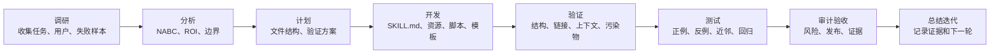

**简体中文** | [English](README.en.md) | [日本語](README.ja.md) | [한국어](README.ko.md) | [Português](README.pt.md) | [Русский](README.ru.md) | [Français](README.fr.md) | [Italiano](README.it.md) | [Deutsch](README.de.md) | [Bahasa Indonesia](README.id.md) | [हिन्दी](README.hi.md)


# BLCaptain Meta Skill：把经验做成可复用 Skill 的 Skill

当前版本：v1.0

如果你已经开始高频使用 AI，大概率会遇到一个很现实的问题：

同一类任务，你讲过很多遍；同一套标准，AI 还是会忘；同一个工作流，每次都要重新解释一遍。

BLCaptain Meta Skill 就是为了解决这个问题而做的。

它面向 Claude Skills、Codex Skills 和通用 Agent Skills，帮助你把一套反复使用的经验、流程、SOP、工具套路、设计标准或创作方法，整理成一个可安装、可调用、可验证、可迭代的 Skill 包。

它不是让你再写一段更长的 prompt，而是帮你把“我会怎么做”沉淀成“Agent 可以稳定复用的能力产品”。

> 你提供一个重复发生、值得沉淀的工作流；它帮你判断要不要做成 Skill，并指导你把它做成真正能交付的能力产品。

## 这个 Skill 从哪里来

这个 Skill 是 Codex 和 Claude Code 进行了 7 轮协同迭代后的结果。

整个开发过程严格遵循 8 步流程：

```text
调研 → 分析 → 计划 → 开发 → 验证 → 测试 → 审计验收 → 总结迭代
```

协作方式很直接：

| 角色 | 主要工作 |
| --- | --- |
| Claude Code | 读代码、拆需求、做架构规划、提出 review 与审计意见 |
| Codex | 执行代码修改、跑命令、修测试、补证据、做发布前验证 |
| 人类评审 | 判断方向、约束边界、确认是否继续整改和发布 |

每一轮都不是“看起来差不多就过”，而是先让 Claude Code 审查，再由 Codex 修复，再重新跑验证。反复 7 轮之后，才沉淀成现在这个可公开发布的版本。

这也是它的核心立场：Skill 不是写出来的，是被真实场景、失败案例、验证命令和审计反馈打磨出来的。

## 为什么需要它

很多人做 AI 工作流，会经历三个阶段：

| 阶段 | 常见状态 | 问题 |
| --- | --- | --- |
| 会用 AI | 能写 prompt，能让 AI 完成单次任务 | 每次都要重新解释，结果不稳定 |
| 会沉淀方法 | 有 SOP、模板、提示词、案例 | 人能理解，Agent 不一定能稳定执行 |
| 会产品化能力 | 有 Skill、资源、脚本、eval、发布检查 | 能复用、能验证、能迭代、能交付 |

BLCaptain Meta Skill 解决的是第三阶段：把个人经验、团队方法、业务流程、创作套路，升级成 Agent 可以调用的能力包。

你可以把它理解成：

- 给 AI 用户的“Skill 制作教练”。
- 给产品和运营的“流程产品化框架”。
- 给工程师的“Agent 能力交付规范”。
- 给创作者的“内容工作流复用系统”。
- 给团队的“把隐性经验变成显性资产”的方法论。

## 它解决什么问题

很多人做 Skill 时，会卡在这些地方：

| 常见问题 | 结果 | 这个 Skill 怎么帮你 |
| --- | --- | --- |
| 把 Skill 当成一段长提示词 | 写得很满，但 Agent 不知道什么时候该用 | 先设计触发边界、正例、反例和路由描述 |
| 什么都想塞进 `SKILL.md` | 上下文变重，加载后反而笨 | 用“薄入口 + 厚资源”的结构拆分 |
| 没有验证 | 看起来完整，实际一用就跑偏 | 配 route eval、scenario eval、failure library 和回归记录 |
| 不知道该不该做成 Skill | 一次性任务也被产品化，维护成本变高 | 先跑 Non-Skill gate，过滤不值得做的任务 |
| 缺少失败经验 | 正常例子能跑，边界情况崩掉 | 把 gotchas、反例、风险和修复策略作为一等资产 |
| 发布前不敢确定 | 文件齐了，但不知道能不能公开 | 用 validator、context budget、quick validate 和发布检查表验收 |

换句话说，它帮你从“我觉得这个 prompt 还不错”，走到“这个能力包能被别人安装、理解、调用、验证、继续维护”。

## 适合谁

这个 Skill 适合所有想把“自己的方法”变成“Agent 可复用能力”的人：

- AI 用户：把常用任务、个人偏好、写作方式和工作流沉淀下来。
- 产品经理：把需求分析、PRD、用户访谈、竞品分析和评审流程变成稳定方法。
- 运营人员：把 SOP、内容分发、活动复盘、社群维护和用户触达做成可重复流程。
- 开发者 / 工程师：把编码纪律、测试、发布、审查和工具链封装成可执行 Skill。
- 测试人员：为 Skill 设计正例、反例、边界用例和回归验证。
- 设计师：把审美规则、品牌约束、版式体系和设计禁忌转成 Agent 能执行的标准。
- 创作者：把文章、图文、视频脚本、PPT、课程和选题方法做成内容生产飞轮。
- 行业专家：把专业判断、咨询流程、客户服务标准和业务经验产品化。

## 适用范围

最适合做成 Skill 的任务，通常有这些特点：

| 特点 | 说明 |
| --- | --- |
| 高频重复 | 不是一次性问题，而是你以后还会反复做 |
| 有明确产物 | 最后能交付文档、代码、图片、表格、审计报告或方案 |
| 有判断标准 | 能说清楚什么叫好、什么叫坏、什么叫不能交付 |
| 有边界条件 | 知道哪些场景该触发，哪些场景不该触发 |
| 有失败样本 | 知道 AI 容易在哪里犯错，并能把这些错误沉淀成规则 |
| 值得维护 | 节省的时间、降低的风险或提升的质量，超过维护成本 |

不太适合做成 Skill 的任务：

- 只问一个事实，不需要后续复用。
- 只是让 AI 总结、翻译、改写一次。
- 还没有稳定流程，只是临时探索想法。
- 没有验证意愿，只想让 Skill 看起来完整。

## 你可以用它做什么

| 用途 | 适合的场景 |
| --- | --- |
| 从 0 创建 Skill | 你有一套重复工作流，但不知道如何拆成 `SKILL.md`、资源、脚本和 eval |
| 升级旧 prompt | 你有一个好用的提示词，但它太长、太脆弱、不可验证 |
| 审查现有 Skill | 你已经做了 Skill，但不确定触发边界、测试、风险和发布准备是否完整 |
| 做团队 SOP | 你想把团队经验变成 Agent 可执行流程，而不是只存在文档里 |
| 做创作流水线 | 你想把文章、图文、视频、PPT、课程的生产方法沉淀成可复用能力 |
| 做发布验收 | 你准备公开到 GitHub，需要检查结构、隐私、污染物、token 和验证证据 |

## 它会产出什么

它不会只给你一段提示词，而是指导你做出一个结构完整的 Skill 包。

典型产物包括：

| 产物 | 用途 |
| --- | --- |
| `SKILL.md` | 极简入口，告诉 Agent 什么时候加载、先做什么、去哪读资源 |
| `references/` | 深层方法、边界、操作步骤、角色协作和平台差异 |
| `assets/templates/` | brief、设计规格、eval case、gotcha、迭代记录等模板 |
| `scripts/` | 可执行验证脚本，把确定性检查交给程序 |
| `evals/` | 路由、场景、失败库、forward-test 和回归证据 |
| `examples/` | 可读的 worked examples，让用户知道怎么落地 |
| `manifest.json` | 版本、状态、验证命令、证据文件和发布治理信息 |

## 工作流

这个 Skill 强制按 8 步推进，避免一上来就写文件：



这 8 步的含义很朴素：

| 步骤 | 要解决的问题 |
| --- | --- |
| 调研 | 用户是谁？真实任务是什么？有哪些成功和失败样本？ |
| 分析 | 是否值得做成 Skill？边界、ROI、竞品替代方案是什么？ |
| 计划 | 文件结构、资源分层、验证方案、发布标准怎么定？ |
| 开发 | 编写 `SKILL.md`、references、templates、scripts、evals |
| 验证 | 检查结构、链接、上下文预算、隐私残留和发布污染物 |
| 测试 | 用正例、反例、近邻场景和失败库证明它能工作 |
| 审计验收 | 用审查标准判断是否能发布，以及还缺什么证据 |
| 总结迭代 | 记录本轮结论、残余风险、下一轮改进点 |

一句话版：先判断值不值得做，再设计边界，再写最小 Skill，再用证据证明它真的有用。

## 核心机制

### 1. Non-Skill Gate

不是所有东西都应该做成 Skill。

它会先判断这个需求更适合：

- 一次性回答
- 普通文档
- 项目规则
- 脚本 / CLI
- 模板
- 记忆
- 真正的 Skill

只有当任务高频、可复用、有明确交付标准、能被验证，而且比普通提示词更值得维护时，才进入 Skill 设计。

### 2. NABC + ROI 判断

它会像做一个能力产品一样评估 Skill：

| 维度 | 要回答的问题 |
| --- | --- |
| Need | 用户真实痛点是什么？是不是重复发生？ |
| Approach | Skill 用什么流程、资源、脚本和约束解决？ |
| Benefit | 相比普通聊天，节省什么、提升什么、降低什么风险？ |
| Competition | 为什么不是文档、脚本、模板、项目规则或一次性 prompt？ |

### 3. 薄入口，厚资源

好的 Skill 入口应该短。

`SKILL.md` 只放高信号内容：触发、第一步、资源导航、关键规则和常用命令。复杂方法、案例、失败库、模板和脚本都放到资源目录里，需要时再加载。

### 4. 失败库优先

真正让 Skill 稳定的，不是“要做好”的口号，而是这些边界：

- 什么场景不能触发。
- 什么输出看起来对但实际错。
- 哪些平台规则容易变。
- 哪些动作必须先问用户。
- 哪些命令会有权限或安全风险。

### 5. 证据驱动发布

它要求你用事实证明 Skill 可以工作：

- route eval：该触发时触发，不该触发时不触发。
- scenario eval：典型用户场景能走通。
- failure library：已知失败有记录、有修复建议。
- regression history：改动后能证明问题没有回来。
- validator：结构、资源、污染物、私有路径和治理字段可检查。

## 使用方式

安装后，你可以这样叫它：

```text
Use $blcaptain-meta-skill 帮我把这个重复工作流做成一个可发布的 Agent Skill。
```

也可以更具体：

```text
Use $blcaptain-meta-skill 我有一套社媒图文卡片生产流程，想做成 Skill。
```

```text
Use $blcaptain-meta-skill 请审查这个现有 Skill，补齐 eval、gotchas、发布检查和治理信息。
```

```text
Use $blcaptain-meta-skill 判断这个 SOP 到底适不适合做成 Skill，如果适合请给出结构和验证方案。
```

正常情况下，它会先问或检查：

1. 这个工作流是否重复发生。
2. 谁会用它。
3. 输入是什么，输出是什么。
4. 什么情况不该触发。
5. 有没有真实失败案例。
6. 需要哪些脚本、模板、资产或外部工具。
7. 发布前如何证明它能稳定工作。

## 安装

### Codex / 本地 Agent

把 `blcaptain-meta-skill/` 目录放入你的 skills 目录。

```bash
mkdir -p ~/.codex/skills
cp -R blcaptain-meta-skill ~/.codex/skills/
```

打开新会话后使用：

```text
Use $blcaptain-meta-skill 我想把一个重复工作流做成 Skill。
```

### Claude Skills / 其他 Agent

如果你的 Agent 支持本地 Skills：

1. 让 Agent 能读取 `blcaptain-meta-skill/SKILL.md`。
2. 确认它能访问 `references/`、`assets/templates/`、`examples/`、`evals/` 和 `scripts/`。
3. 按目标平台重新核实安装路径和 metadata 要求。
4. 运行验证命令确认包结构可用。

## 验证

进入仓库根目录后运行：

```bash
python3 blcaptain-meta-skill/scripts/validate_meta_skill.py blcaptain-meta-skill
python3 blcaptain-meta-skill/scripts/eval_routes.py blcaptain-meta-skill/evals/route_cases.json
python3 blcaptain-meta-skill/scripts/context_budget.py blcaptain-meta-skill/SKILL.md
python3 "${CODEX_HOME:-$HOME/.codex}/skills/.system/skill-creator/scripts/quick_validate.py" blcaptain-meta-skill
```

如果要公开发布或做更严格的 token / 视觉 / 清洁审计，请按 `RELEASE_CHECKLIST.md` 跑完整检查。README 只保留日常最常用命令，避免第一次使用的人被发布工程细节淹没。

## 目录结构

```text
.
├── README.md
├── RELEASE_CHECKLIST.md
├── docs/
│   └── blcaptain-meta-skill-design.md
├── blcaptain-meta-skill/
│   ├── SKILL.md
│   ├── agents/
│   │   └── openai.yaml
│   ├── references/
│   ├── assets/
│   │   ├── templates/
│   │   └── visual-validation/
│   ├── examples/
│   ├── evals/
│   ├── scripts/
│   └── manifest.json
└── third-round-forward-test/
    ├── baseline/
    └── with-meta-skill/
```

## 典型场景

| 场景 | 你可以怎么说 |
| --- | --- |
| 从 0 做新 Skill | “我有一个重复工作流，帮我判断是否值得做成 Skill，并给出实现结构。” |
| 改造旧提示词 | “这是我常用的一段 prompt，帮我升级成可安装 Skill。” |
| 审查现有 Skill | “请检查这个 Skill 是否有路由、eval、gotchas、发布污染物和治理缺口。” |
| 做团队 SOP | “把这套运营 SOP 变成 Agent 能执行、能验证、能迭代的 Skill。” |
| 做创作流程 | “把我的内容生产流程做成 Skill，要求能沉淀模板、反例和平台检查。” |
| 准备发布 | “请按发布检查表跑一轮验证，告诉我是否能公开到 GitHub。” |

## FAQ

### 这是一个 prompt 吗？

不是。它包含 prompt，但核心是一个能力包：入口、资源、模板、脚本、验证、证据和发布治理都在一起。

### 我没有技术背景能用吗？

可以。你可以只描述自己的工作流和目标，让 Agent 按这个 Skill 的流程帮你拆解。但如果要发布到 GitHub，建议让懂工程验证的人帮你跑一遍脚本和发布检查。

### 什么样的任务最值得做成 Skill？

重复发生、价值较高、步骤稳定、容易出错、能验证、能复用的任务。

### 什么样的任务不值得做成 Skill？

一次性解释、简单总结、临时脑暴、单次翻译、没有稳定流程的探索，都不太值得。

### 它能直接替我发布 Skill 吗？

它能指导你完成结构、脚本、验证和发布准备，但是否公开发布仍需要人确认：隐私、真实素材、仓库说明、发布口径和维护责任。

### 为什么要有这么多 eval 和检查？

因为 Skill 的价值不是“写得像”，而是“用起来稳定”。没有验证，就很难知道它是在帮忙，还是只是多了一层包装。

## 关于作者

爆裂队长NEXT

15yr PM. Fired myself. Hired 10 AIs. Turns out managing AIs is harder than managing humans.

AI Agents BLTeam 翻车笔记。真实战，生产级真干货持续分享。少刷二手情绪，多看一手信号源。

X/Twitter: [@thinkszyg](https://x.com/thinkszyg)

邮箱: blteam2026@outlook.com
