**Idioma:** [简体中文](README.md) | [English](README.en.md) | [日本語](README.ja.md) | [한국어](README.ko.md) | **Português** | [Русский](README.ru.md) | [Français](README.fr.md) | [Italiano](README.it.md) | [Deutsch](README.de.md) | [Bahasa Indonesia](README.id.md) | [हिन्दी](README.hi.md)


# BLCaptain Meta Skill: o Skill para criar Skills reutilizáveis

Versão: v1.0

Se você usa IA com frequência, provavelmente já encontrou um problema bem prático:

Você explica a mesma tarefa várias vezes. Repete os mesmos critérios. O mesmo fluxo de trabalho precisa ser recontado em cada nova conversa.

BLCaptain Meta Skill foi criado para resolver isso.

Ele é compatível com Claude Skills, Codex Skills e Agent Skills genéricos. Ajuda a transformar experiências repetíveis, SOPs, rotinas de ferramentas, padrões de design e processos criativos em um pacote de Skill instalável, acionável, verificável e iterável.

Ele não é “mais um prompt longo”. Ele transforma “é assim que eu faço” em “uma capacidade que um Agent consegue reutilizar com estabilidade”.

> Você traz um fluxo repetível que vale preservar; ele ajuda a decidir se deve virar Skill e guia a criação de um pacote de capacidade realmente entregável.

## Origem

Este Skill é resultado de 7 rodadas de colaboração e iteração entre Codex e Claude Code.

O desenvolvimento seguiu um fluxo de 8 etapas:

```text
Pesquisa -> Análise -> Plano -> Desenvolvimento -> Verificação -> Testes -> Aceite de Auditoria -> Resumo e Iteração
```

| Papel | Trabalho principal |
| --- | --- |
| Claude Code | Leu código, decompôs requisitos, planejou arquitetura, fez review e auditoria |
| Codex | Editou código, executou comandos, corrigiu testes, adicionou evidências, fez checagens de release |
| Revisor humano | Definiu direção, limites, continuidade das correções e decisão de publicação |

Cada rodada passou por review, correção, nova verificação e nova auditoria. A versão pública atual foi moldada por cenários reais, casos de falha, comandos de validação e feedback de revisão.

## Por que usar

Fluxos de IA costumam evoluir em três níveis:

| Etapa | Estado comum | Problema |
| --- | --- | --- |
| Usar IA | Você escreve prompts e resolve tarefas pontuais | Precisa repetir contexto; resultados variam |
| Registrar métodos | Você tem SOPs, modelos, prompts e casos | Humanos entendem, mas o Agent pode não executar com estabilidade |
| Produto de capacidade | Você tem Skill, recursos, scripts, evals e checagens de release | O fluxo vira reutilizável, verificável, manutenível e entregável |

BLCaptain Meta Skill foca no terceiro nível: transformar conhecimento pessoal, métodos de equipe, processos de negócio e sistemas criativos em capacidades reutilizáveis para Agents.

## Problemas que resolve

| Problema comum | Resultado | Como este Skill ajuda |
| --- | --- | --- |
| Tratar Skill como prompt longo | Muito texto, gatilho confuso | Primeiro desenha fronteiras de acionamento, exemplos positivos, negativos e roteamento |
| Colocar tudo em `SKILL.md` | Contexto pesado piora o Agent | Usa “entrada fina + recursos profundos” |
| Não validar | Parece completo, falha no uso real | Adiciona route eval, scenario eval, failure library e histórico de regressão |
| Não saber se precisa de Skill | Tarefas únicas viram custo de manutenção | Usa Non-Skill gate antes da implementação |
| Não registrar falhas | Caminho feliz funciona, bordas quebram | Trata gotchas, contraexemplos, riscos e correções como ativos |
| Insegurança antes de publicar | Arquivos existem, confiança é baixa | Usa validator, context budget, quick validate e checklist de release |

Em resumo, ele ajuda a sair de “este prompt parece bom” para “este pacote pode ser instalado, entendido, chamado, verificado e mantido por outras pessoas”.

## Para quem é

- Usuários de IA: guardar tarefas frequentes, preferências, estilo de escrita e fluxos pessoais.
- Produto: transformar análise de requisitos, PRD, entrevistas, pesquisa competitiva e review em método estável.
- Operações: empacotar SOPs, distribuição de conteúdo, retrospectivas, comunidade e contato com usuários.
- Desenvolvedores / engenheiros: codificar disciplina de código, testes, release, review e toolchain.
- Testadores: criar casos positivos, negativos, de fronteira e regressão.
- Designers: converter regras de gosto, marca, layout e restrições em padrões executáveis.
- Criadores: construir fluxos reutilizáveis para artigos, visuais, vídeos, decks, cursos e pautas.
- Especialistas: productizar julgamento profissional, consultoria, padrões de serviço e experiência de negócio.

## Escopo

Tarefas boas para virar Skill geralmente têm:

| Característica | Significado |
| --- | --- |
| Repetição frequente | Não é única; será feita de novo |
| Entregável claro | Pode virar documento, código, imagem, planilha, auditoria ou plano |
| Critério de qualidade | Dá para explicar o que é bom, ruim e não publicável |
| Fronteiras | Você sabe quando deve e não deve acionar |
| Exemplos de falha | Você sabe onde a IA erra e pode transformar isso em regras |
| Valor de manutenção | Tempo economizado, risco reduzido ou qualidade melhor superam o custo |

Pouco indicado para:

- Pergunta factual única.
- Resumo, tradução ou reescrita de uma vez.
- Exploração inicial sem processo estável.
- Fluxos que ninguém quer validar.

## Usos possíveis

| Uso | Situação ideal |
| --- | --- |
| Criar Skill do zero | Você tem um fluxo repetível, mas não sabe dividir `SKILL.md`, recursos, scripts e evals |
| Melhorar prompt antigo | Você tem um prompt útil, mas longo, frágil ou impossível de testar |
| Revisar Skill existente | Você precisa checar gatilhos, testes, riscos e prontidão de publicação |
| Criar SOP de equipe | Você quer transformar conhecimento de equipe em fluxo executável por Agent |
| Criar pipeline criativo | Você quer reutilizar fluxos de artigos, imagens, vídeos, decks ou cursos |
| Preparar release | Você precisa checar estrutura, privacidade, poluentes, tokens e evidências antes do GitHub |

## O que ele produz

| Saída | Finalidade |
| --- | --- |
| `SKILL.md` | Entrada fina: quando carregar, o que fazer primeiro, onde buscar recursos |
| `references/` | Métodos, fronteiras, passos, colaboração por papéis e diferenças de plataforma |
| `assets/templates/` | Modelos de brief, especificação, eval case, gotcha e registro de iteração |
| `scripts/` | Scripts de validação determinísticos |
| `evals/` | Roteamento, cenários, biblioteca de falhas, forward tests e regressões |
| `examples/` | Exemplos trabalhados mostrando aplicação |
| `manifest.json` | Versão, status, comandos de validação, arquivos de evidência e governança |

## Fluxo de trabalho

```mermaid
flowchart LR
    A["Pesquisa<br/>Coletar tarefas, usuários, falhas"] --> B["Análise<br/>NABC, ROI, fronteiras"]
    B --> C["Plano<br/>Estrutura de arquivos, validação"]
    C --> D["Desenvolvimento<br/>SKILL.md, recursos, scripts, modelos"]
    D --> E["Verificação<br/>Estrutura, links, contexto, poluentes"]
    E --> F["Testes<br/>Positivo, negativo, vizinho, regressão"]
    F --> G["Aceite de Auditoria<br/>Riscos, release, evidências"]
    G --> H["Resumo e Iteração<br/>Registrar evidências e próxima rodada"]
```



| Etapa | Pergunta respondida |
| --- | --- |
| Pesquisa | Quem é o usuário? Qual é a tarefa real? Quais são exemplos de sucesso e falha? |
| Análise | Vale virar Skill? Quais são fronteiras, ROI e alternativas? |
| Plano | Qual estrutura, camada de recursos, validação e padrão de release usar? |
| Desenvolvimento | Escrever `SKILL.md`, references, templates, scripts e evals |
| Verificação | Checar estrutura, links, orçamento de contexto, resíduos privados e poluentes |
| Testes | Provar com casos positivos, negativos, próximos e de falha |
| Aceite de Auditoria | Decidir se pode publicar e que evidência falta |
| Resumo e Iteração | Registrar conclusões, riscos residuais e próximos passos |

Versão curta: decidir se vale construir, desenhar fronteiras, criar o menor Skill útil e provar com evidências.

## Mecanismos principais

### 1. Non-Skill Gate

Nem tudo deve virar Skill. Primeiro ele decide se o caso é melhor como:

- Resposta única
- Documento comum
- Regra de projeto
- Script / CLI
- Modelo
- Memória
- Skill real

### 2. NABC + ROI

| Dimensão | Pergunta |
| --- | --- |
| Need | Qual dor real do usuário? Ela se repete? |
| Approach | Que fluxo, recursos, scripts e restrições resolvem? |
| Benefit | O que economiza, melhora ou reduz de risco contra chat comum? |
| Competition | Por que não documento, script, modelo, regra de projeto ou prompt único? |

### 3. Entrada fina, recursos profundos

`SKILL.md` deve ser curto e de alto sinal. Métodos complexos, exemplos, falhas, templates e scripts ficam em recursos carregados apenas quando necessário.

### 4. Biblioteca de falhas primeiro

Skills estáveis registram quando não acionar, saídas que parecem certas mas estão erradas, regras de plataforma que podem mudar, ações que exigem pergunta ao usuário e comandos com risco de permissão ou segurança.

### 5. Release guiado por evidências

Confiança vem de route evals, scenario evals, failure library, regression history, validators, context budgets e higiene de release.

## Uso

```text
Use $blcaptain-meta-skill para transformar este fluxo repetível em um Agent Skill publicável.
```

```text
Use $blcaptain-meta-skill Tenho um fluxo de produção de cards sociais e quero transformá-lo em Skill.
```

```text
Use $blcaptain-meta-skill Revise este Skill existente e complete evals, gotchas, checagens de release e governança.
```

## Instalação

### Codex / Agent local

Copie `blcaptain-meta-skill/` para seu diretório de skills.

```bash
mkdir -p ~/.codex/skills
cp -R blcaptain-meta-skill ~/.codex/skills/
```

Em uma nova sessão:

```text
Use $blcaptain-meta-skill Quero transformar um fluxo repetível em Skill.
```

### Claude Skills / outros Agents

1. Permita que o Agent leia `blcaptain-meta-skill/SKILL.md`.
2. Confirme acesso a `references/`, `assets/templates/`, `examples/`, `evals/` e `scripts/`.
3. Revalide caminho de instalação e regras de metadata da plataforma alvo.
4. Rode comandos de validação antes de publicar.

## Verificação

```bash
python3 blcaptain-meta-skill/scripts/validate_meta_skill.py blcaptain-meta-skill
python3 blcaptain-meta-skill/scripts/eval_routes.py blcaptain-meta-skill/evals/route_cases.json
python3 blcaptain-meta-skill/scripts/context_budget.py blcaptain-meta-skill/SKILL.md
python3 "${CODEX_HOME:-$HOME/.codex}/skills/.system/skill-creator/scripts/quick_validate.py" blcaptain-meta-skill
```

Para checagens mais rígidas de token, visual e higiene de release, use `RELEASE_CHECKLIST.md`.

## Estrutura do repositório

```text
.
├── README.md
├── README.pt.md
├── RELEASE_CHECKLIST.md
├── docs/
├── blcaptain-meta-skill/
└── third-round-forward-test/
```

## Cenários típicos

| Cenário | Como pedir |
| --- | --- |
| Novo Skill do zero | “Tenho um fluxo repetível. Ajude a decidir se deve virar Skill e desenhe a estrutura.” |
| Atualizar prompt antigo | “Transforme este prompt em um Skill instalável.” |
| Revisar Skill existente | “Cheque routing, evals, gotchas, poluentes de release e lacunas de governança.” |
| SOP de equipe | “Transforme este SOP operacional em um Skill executável, verificável e iterável.” |
| Fluxo criativo | “Transforme meu processo de conteúdo em Skill com modelos, contraexemplos e checagens de plataforma.” |
| Preparar release | “Rode o checklist de release e diga se está pronto para GitHub.” |

## FAQ

### Isso é só um prompt?

Não. Ele inclui prompts, mas o núcleo é um pacote de capacidade: entrada, recursos, templates, scripts, validação, evidência e governança de release.

### Pessoas não técnicas podem usar?

Sim. Descreva seu fluxo e objetivo; o Agent pode seguir este Skill para decompor tudo. Para publicar no GitHub, peça a alguém confortável com checagens de engenharia para rodar os scripts.

### Quais tarefas são mais adequadas?

Tarefas repetidas, valiosas, estáveis, propensas a erro, verificáveis e reutilizáveis.

### Quais tarefas não são adequadas?

Explicações únicas, resumos simples, brainstorm temporário, traduções únicas e explorações instáveis.

### Ele publica o Skill por mim?

Ele prepara estrutura, scripts, validação e checagens de release. Humanos ainda decidem privacidade, materiais reais, texto do repositório, posicionamento público e responsabilidade de manutenção.

## Autor

爆裂队长NEXT

15yr PM. Fired myself. Hired 10 AIs. Turns out managing AIs is harder than managing humans.

Notas de campo do AI Agents BLTeam. Prática real de produção e sinais primários duráveis.

X/Twitter: [@thinkszyg](https://x.com/thinkszyg)

Email: blteam2026@outlook.com
