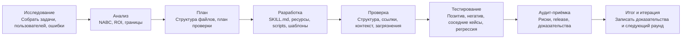

**Язык:** [简体中文](README.md) | [English](README.en.md) | [日本語](README.ja.md) | [한국어](README.ko.md) | [Português](README.pt.md) | **Русский** | [Français](README.fr.md) | [Italiano](README.it.md) | [Deutsch](README.de.md) | [Bahasa Indonesia](README.id.md) | [हिन्दी](README.hi.md)


# BLCaptain Meta Skill: Skill для создания переиспользуемых Skills

Версия: v1.0

Если вы часто используете ИИ, вы наверняка сталкивались с простой, но болезненной проблемой:

одну и ту же задачу приходится объяснять снова, одни и те же стандарты повторять снова, один и тот же рабочий процесс каждый раз пересказывать заново.

BLCaptain Meta Skill создан именно для этого.

Он поддерживает Claude Skills, Codex Skills и универсальные Agent Skills. Он помогает превращать повторяемый опыт, SOP, инструментальные рутины, дизайн-стандарты и творческие процессы в устанавливаемый, вызываемый, проверяемый и улучшаемый Skill-пакет.

Это не «ещё один длинный prompt». Это способ превратить «я делаю это так» в «способность, которую Agent может стабильно переиспользовать».

> Вы приносите повторяемый рабочий процесс, который стоит сохранить; Skill помогает решить, нужно ли превращать его в Skill, и доводит до поставляемого пакета возможностей.

## Откуда он появился

Этот Skill — результат 7 раундов совместной итерации Codex и Claude Code.

Разработка следовала 8-шаговому процессу:

```text
Исследование -> Анализ -> План -> Разработка -> Проверка -> Тестирование -> Аудит-приёмка -> Итог и итерация
```

| Роль | Основная работа |
| --- | --- |
| Claude Code | Читал код, декомпозировал требования, планировал архитектуру, давал review и аудит |
| Codex | Правил код, запускал команды, исправлял тесты, добавлял доказательства, делал release-check |
| Человек-рецензент | Задавал направление, ограничивал область, решал продолжать ли исправления и публиковать |

Каждый раунд проходил review, исправления, повторную проверку и аудит. Публичная версия сформирована реальными сценариями, ошибками, командами валидации и обратной связью.

## Зачем он нужен

Работа с ИИ обычно проходит три уровня:

| Уровень | Типичное состояние | Проблема |
| --- | --- | --- |
| Использовать ИИ | Вы пишете prompts и закрываете разовые задачи | Контекст приходится повторять; результаты нестабильны |
| Фиксировать метод | Есть SOP, шаблоны, prompts и примеры | Люди понимают, но Agent не всегда стабильно выполняет |
| Продуктизировать способность | Есть Skill, ресурсы, scripts, evals и release checks | Процесс можно переиспользовать, проверять, поддерживать и передавать |

BLCaptain Meta Skill работает на третьем уровне: превращает личный опыт, командные методы, бизнес-процессы и творческие системы в переиспользуемые Agent capabilities.

## Какие проблемы решает

| Частая проблема | Результат | Как помогает Skill |
| --- | --- | --- |
| Skill воспринимают как длинный prompt | Много текста, неясный trigger | Сначала проектируются границы trigger, позитивные/негативные кейсы и routing |
| Всё кладут в `SKILL.md` | Контекст тяжёлый, Agent работает хуже | Используется структура «тонкий вход + глубокие ресурсы» |
| Нет проверки | Выглядит завершённым, но ломается в реальности | Добавляются route eval, scenario eval, failure library и regression history |
| Непонятно, нужен ли Skill | Разовые задачи превращаются в обслуживание | Перед реализацией применяется Non-Skill gate |
| Нет памяти о сбоях | Happy path работает, edge cases падают | Gotchas, контрпримеры, риски и исправления становятся активами |
| Нет уверенности перед релизом | Файлы есть, доверия мало | Используются validator, context budget, quick validate и release checklist |

Иными словами, он помогает перейти от «этот prompt вроде полезен» к «этот пакет можно установить, понять, вызвать, проверить и поддерживать».

## Для кого

- Пользователи ИИ: сохранять частые задачи, личные предпочтения, стиль письма и рабочие процессы.
- Продуктовые менеджеры: стабилизировать анализ требований, PRD, интервью, конкурентный анализ и review-процессы.
- Операционные команды: упаковывать SOP, дистрибуцию контента, ретроспективы, комьюнити и user outreach.
- Разработчики / инженеры: кодировать дисциплину разработки, тесты, релизы, review и toolchain.
- Тестировщики: проектировать позитивные, негативные, граничные и регрессионные кейсы.
- Дизайнеры: переводить вкус, бренд-ограничения, layout-системы и запреты в исполняемые стандарты.
- Креаторы: строить повторяемые конвейеры для статей, визуалов, видео, deck, курсов и тем.
- Эксперты: продуктизировать профессиональное суждение, консультации, стандарты сервиса и бизнес-опыт.

## Область применения

Хорошие кандидаты для Skill обычно имеют:

| Признак | Значение |
| --- | --- |
| Частая повторяемость | Это не разовая задача; она вернётся |
| Чёткий результат | Можно получить документ, код, изображение, таблицу, аудит или план |
| Критерии качества | Можно объяснить, что хорошо, плохо и неприемлемо |
| Границы | Понятно, когда trigger нужен и когда нет |
| Примеры ошибок | Известно, где ИИ ошибается, и это можно превратить в правила |
| Ценность поддержки | Экономия времени, снижение риска или рост качества выше стоимости поддержки |

Плохие кандидаты:

- Разовый фактологический вопрос.
- Однократное резюме, перевод или переписывание.
- Раннее исследование без стабильного процесса.
- Процессы, которые никто не хочет проверять.

## Для чего использовать

| Использование | Подходящий случай |
| --- | --- |
| Создать Skill с нуля | Есть повторяемый процесс, но непонятно, как разделить `SKILL.md`, ресурсы, scripts и evals |
| Улучшить старый prompt | Prompt полезен, но слишком длинный, хрупкий или непроверяемый |
| Проверить существующий Skill | Нужно проверить trigger boundaries, тесты, риски и готовность к release |
| Создать SOP команды | Нужно превратить командное знание в процесс, исполняемый Agent |
| Создать творческий pipeline | Нужно переиспользовать процессы статей, визуалов, видео, deck или курсов |
| Подготовить release | Нужно проверить структуру, приватность, загрязнения, token budget и доказательства перед GitHub |

## Что он создаёт

| Артефакт | Назначение |
| --- | --- |
| `SKILL.md` | Тонкий вход: когда грузить, что делать сначала, где читать ресурсы |
| `references/` | Глубокие методы, границы, шаги, роли и различия платформ |
| `assets/templates/` | Шаблоны brief, спецификаций, eval case, gotcha и iteration record |
| `scripts/` | Детерминированные scripts проверки |
| `evals/` | Routing, scenarios, failure library, forward tests и regression evidence |
| `examples/` | Примеры применения |
| `manifest.json` | Версия, статус, команды проверки, evidence files и release governance |

## Workflow



| Шаг | На какой вопрос отвечает |
| --- | --- |
| Исследование | Кто пользователь? Какая реальная задача? Какие успешные и неуспешные примеры? |
| Анализ | Стоит ли делать Skill? Каковы границы, ROI и альтернативы? |
| План | Какая структура, слои ресурсов, план проверки и release standard? |
| Разработка | Написать `SKILL.md`, references, templates, scripts и evals |
| Проверка | Проверить структуру, ссылки, budget контекста, приватные остатки и release pollutants |
| Тестирование | Доказать работу позитивными, негативными, соседними и failure cases |
| Аудит-приёмка | Решить, можно ли выпускать и каких доказательств не хватает |
| Итог и итерация | Записать выводы, остаточные риски и следующие улучшения |

Коротко: решить, стоит ли строить, спроектировать границы, собрать минимально полезный Skill и доказать работоспособность.

## Основные механизмы

### 1. Non-Skill Gate

Не всё нужно превращать в Skill. Сначала проверяется, что лучше подходит:

- Разовый ответ
- Обычная документация
- Правила проекта
- Script / CLI
- Шаблон
- Память
- Настоящий Skill

### 2. NABC + ROI

| Измерение | Вопрос |
| --- | --- |
| Need | Какая реальная боль пользователя? Повторяется ли она? |
| Approach | Каким процессом, ресурсами, scripts и ограничениями решаем? |
| Benefit | Что экономит, улучшает или снижает риск по сравнению с обычным чатом? |
| Competition | Почему не документ, script, шаблон, правило проекта или разовый prompt? |

### 3. Тонкий вход, глубокие ресурсы

`SKILL.md` должен быть коротким и высокосигнальным. Сложные методы, примеры, failures, templates и scripts живут в ресурсах и загружаются по необходимости.

### 4. Failure library прежде всего

Стабильный Skill фиксирует, когда не срабатывать, какие outputs выглядят верно, но неверны, какие правила платформ меняются, когда нужно спрашивать пользователя и какие команды несут permission/safety risk.

### 5. Release на доказательствах

Уверенность дают route evals, scenario evals, failure library, regression history, validators, context budgets и release hygiene checks.

## Использование

```text
Use $blcaptain-meta-skill to turn this repeatable workflow into a publishable Agent Skill.
```

```text
Use $blcaptain-meta-skill У меня есть процесс создания карточек для соцсетей, хочу сделать из него Skill.
```

```text
Use $blcaptain-meta-skill Проверь этот Skill и дополни evals, gotchas, release checks и governance.
```

## Установка

### Codex / локальный Agent

Скопируйте `blcaptain-meta-skill/` в каталог skills.

```bash
mkdir -p ~/.codex/skills
cp -R blcaptain-meta-skill ~/.codex/skills/
```

В новой сессии:

```text
Use $blcaptain-meta-skill Хочу превратить повторяемый процесс в Skill.
```

### Claude Skills / другие Agents

1. Agent должен читать `blcaptain-meta-skill/SKILL.md`.
2. Убедитесь, что доступны `references/`, `assets/templates/`, `examples/`, `evals/` и `scripts/`.
3. Проверьте путь установки и metadata rules целевой платформы.
4. Перед публикацией запустите команды проверки.

## Проверка

```bash
python3 blcaptain-meta-skill/scripts/validate_meta_skill.py blcaptain-meta-skill
python3 blcaptain-meta-skill/scripts/eval_routes.py blcaptain-meta-skill/evals/route_cases.json
python3 blcaptain-meta-skill/scripts/context_budget.py blcaptain-meta-skill/SKILL.md
python3 "${CODEX_HOME:-$HOME/.codex}/skills/.system/skill-creator/scripts/quick_validate.py" blcaptain-meta-skill
```

Для более строгих token, visual и release hygiene checks используйте `RELEASE_CHECKLIST.md`.

## Структура репозитория

```text
.
├── README.md
├── README.ru.md
├── RELEASE_CHECKLIST.md
├── docs/
├── blcaptain-meta-skill/
└── third-round-forward-test/
```

## Типичные сценарии

| Сценарий | Как попросить |
| --- | --- |
| Новый Skill с нуля | “У меня есть повторяемый workflow. Помоги понять, нужен ли Skill, и спроектируй структуру.” |
| Обновить старый prompt | “Преврати этот prompt в устанавливаемый Skill.” |
| Review существующего Skill | “Проверь routing, evals, gotchas, release pollutants и governance gaps.” |
| Team SOP | “Преврати этот operational SOP в Skill, который Agent может выполнять, проверять и улучшать.” |
| Creative workflow | “Преврати мой content process в Skill с templates, counterexamples и platform checks.” |
| Release preparation | “Запусти release checklist и скажи, готово ли к GitHub.” |

## FAQ

### Это просто prompt?

Нет. Prompt входит в состав, но ядро — это пакет возможностей: вход, ресурсы, templates, scripts, validation, evidence и release governance.

### Можно использовать без технического опыта?

Да. Опишите workflow и цель; Agent разберёт их по этому Skill. Для GitHub release лучше попросить человека, знакомого с engineering checks, запустить scripts.

### Какие задачи подходят лучше всего?

Повторяемые, ценные, стабильные, склонные к ошибкам, проверяемые и переиспользуемые.

### Какие задачи не подходят?

Разовые объяснения, простые summaries, временный brainstorming, один перевод, нестабильные исследования.

### Может ли он сам опубликовать Skill?

Он готовит структуру, scripts, validation и release checks. Человек решает вопросы приватности, реальных материалов, текста репозитория, публичного позиционирования и ответственности за поддержку.

## Автор

爆裂队长NEXT

15yr PM. Fired myself. Hired 10 AIs. Turns out managing AIs is harder than managing humans.

Полевые заметки AI Agents BLTeam: реальные production-практики и первичные сигналы.

X/Twitter: [@thinkszyg](https://x.com/thinkszyg)

Email: blteam2026@outlook.com

## License

Бесплатно для личного использования и open-source проектов. Закрытое коммерческое использование требует коммерческого разрешения.

Подробности см. в [LICENSE](LICENSE).
